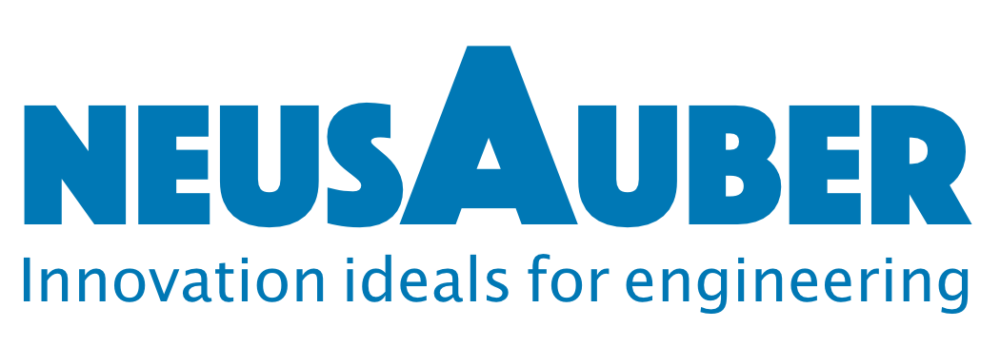

.. _h174fb648377959437b5c1f697c1c40:

關於意杰
########

\ |IMG1|\ 

意杰國際(Neusauber Inc.)，專業特用化學品開發、代理、生產、及銷售，產品著重新創、節能、與環保，結合台灣數個研究單位之顧問團隊，提供合適資訊、創新工法、與先進產品，為客戶解決問題瓶頸，提升技術品質，創造最優價值。

"Neusauber" 為意杰國際品牌註冊商標

"AR透明防鏽劑" 為意杰國際產品註冊商標

|REPLACE1|

.. bottom of content

.. |REPLACE1| raw:: html

    

