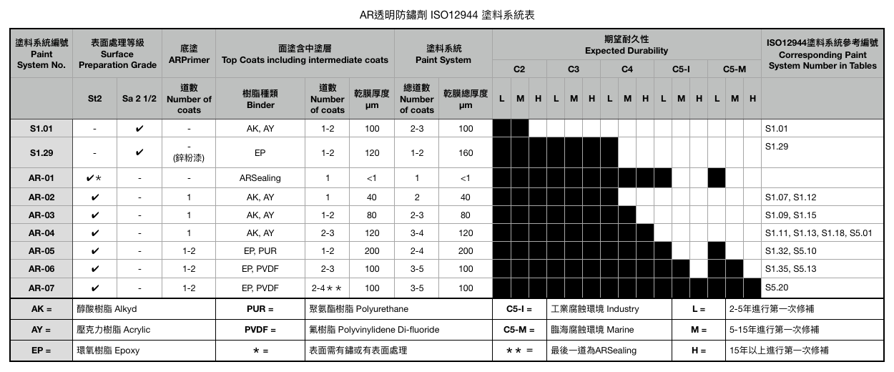
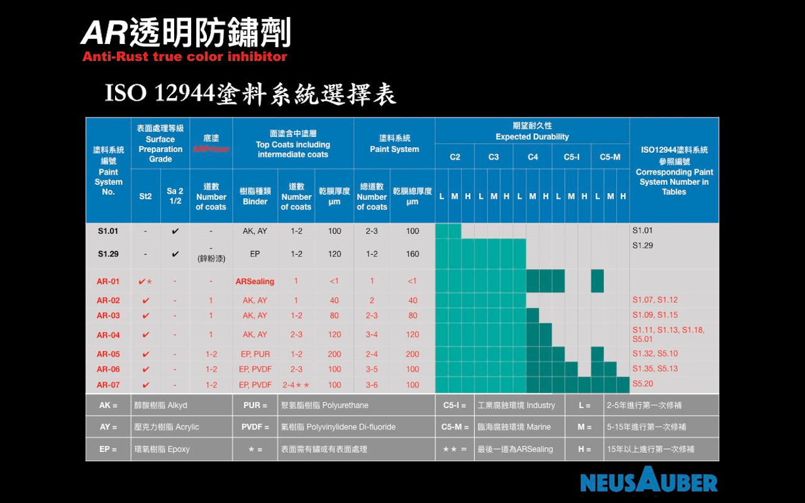

.. _h174fb648377959437b5c1f697c1c40:

使用建議
########

.. _h174fb648377959437b5c1f697c1c40:

使用方式
========

.. admonition:: 施作流程

    \ |IMG1|\ 

.. admonition:: 使用量

    \ |IMG2|\ 

.. admonition:: 防鏽工法與能力

    \ |IMG3|\ 

.. _ha552d4339442b4514686d7839564:

\ |LINK1|\ 
===========

.. _h2c1d74277104e41780968148427e:

.. _h174fb648377959437b5c1f697c1c40:

使用示範
========

|REPLACE1|

\*AR(舊型號) = ARSealing

.. _h68017771fa7c85ef23567fe7b5a:

分盛材質與儲存
==============

|REPLACE2|

\*AR(舊型號) = ARSealing

|REPLACE3|

.. bottom of content

.. |REPLACE1| raw:: html

    <iframe width="100%" height="480" src="https://www.youtube.com/embed/XulGPWDqp_M" frameborder="0" allow="autoplay; encrypted-media" allowfullscreen></iframe>
.. |REPLACE2| raw:: html

    <iframe width="100%" height="480" src="https://www.youtube.com/embed/I0A66Z2vZrI" frameborder="0" allow="autoplay; encrypted-media" allowfullscreen></iframe>
.. |REPLACE3| raw:: html

    

.. |LINK1| raw:: html

    <a href="https://drive.google.com/open?id=1Vw6xsi8q1RKEY8BDrIpcjDn9Ssp4Kd0G" target="_blank">施工手冊下載(請點我)</a>

.. |IMG1| image:: static/Demo_1.png
   :height: 301 px
   :width: 586 px

