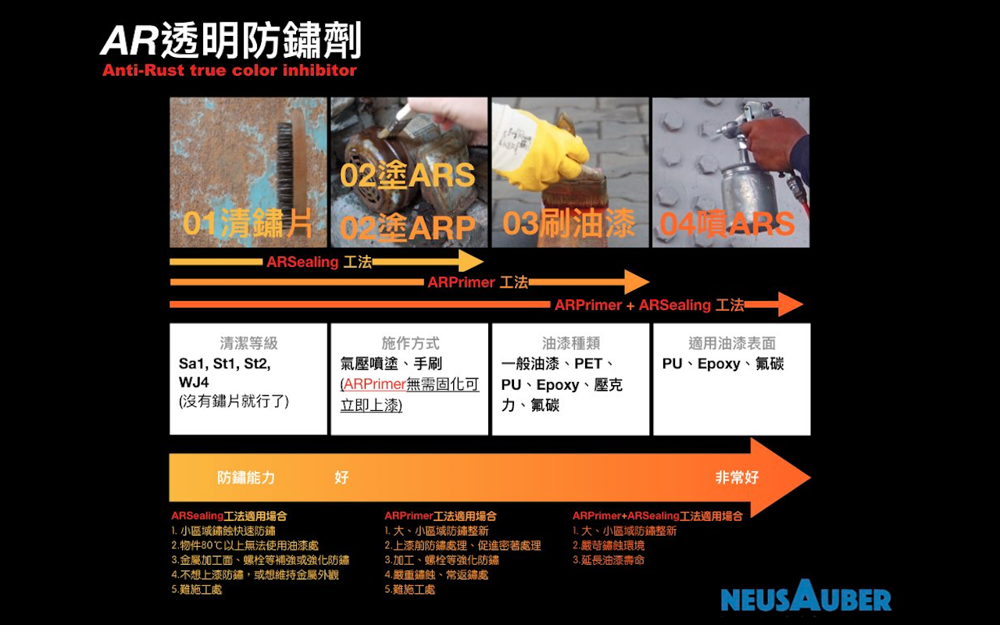

.. _h174fb648377959437b5c1f697c1c40:

使用建議
########

.. _h174fb648377959437b5c1f697c1c40:

施作流程
========

\ |IMG1|\ 

.. _h106d6a60386b4471802c17574203f54:

鏽蝕環境與塗料系統選擇
======================

\ |IMG2|\ 

(參照ISO 12944)

.. _h174fb648377959437b5c1f697c1c40:

使用示範
========

|REPLACE1|

.. _h68017771fa7c85ef23567fe7b5a:

分盛材質與儲存
==============

|REPLACE2|

|REPLACE3|

.. bottom of content

.. |REPLACE1| raw:: html

    <iframe width="100%" height="480" src="https://www.youtube.com/embed/XulGPWDqp_M" frameborder="0" allow="autoplay; encrypted-media" allowfullscreen></iframe>
.. |REPLACE2| raw:: html

    <iframe width="100%" height="480" src="https://www.youtube.com/embed/I0A66Z2vZrI" frameborder="0" allow="autoplay; encrypted-media" allowfullscreen></iframe>
.. |REPLACE3| raw:: html

    

.. |IMG2| image:: static/Demo_2.png
   :height: 249 px
   :width: 601 px
