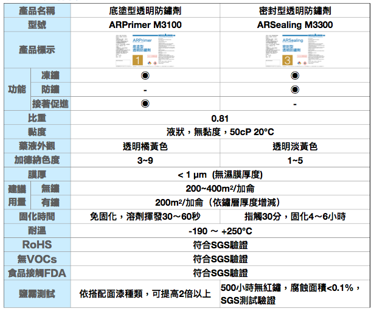
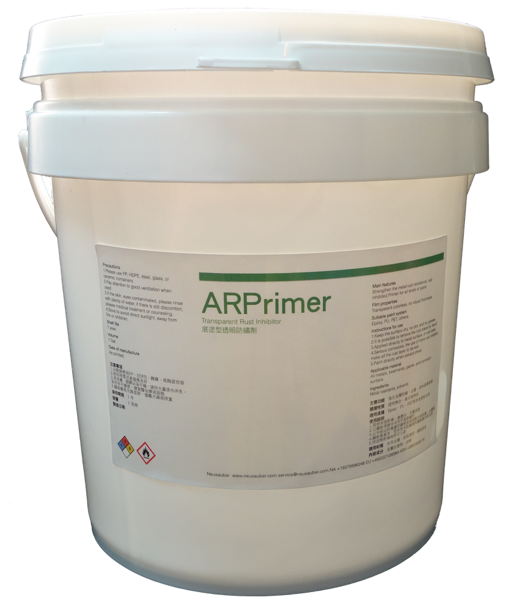
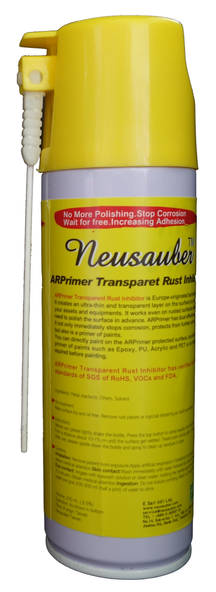

.. _h174fb648377959437b5c1f697c1c40:

產品列表
########

.. _h3d35c515a5a3e1762f7f2c2d67803:

ARPrimer M3100 底塗型透明防鏽劑 專業級1號
=========================================

.. _h2c1d74277104e41780968148427e:

+-------------------------------------------------------------------------------------------------------------------------------------------------------------------------------------------------------------------------------------------+-------------+
|是採用源自歐洲Neusauber技術的透明防鏽劑，免除鏽即可施工，取代紅丹止鏽。ARPrimer的特別配方具備底漆功能，專為搭配面漆而設計，可增加面漆附著功能，取代各式面漆系統底漆．無論新品、鏽蝕舊品皆可使用，超薄透明膜層，讓您輕鬆維護珍貴資產與設備。|  \ |IMG1|\  |
|                                                                                                                                                                                                                                           |             |
|可應用於須上漆保護之各類金屬、烤漆表面部件，食品業器械、機械設備、構件、螺栓、建物等。海邊、溫泉區等嚴苛腐蝕環境皆可使用。                                                                                                                 |             |
|                                                                                                                                                                                                                                           |             |
|適用溫度區間：+250 ~ -190℃                                                                                                                                                                                                                 |             |
|                                                                                                                                                                                                                                           |             |
|平均用量：200 m\ |STYLE0|\  /加侖                                                                                                                                                                                                          |             |
|                                                                                                                                                                                                                                           |             |
|包裝種類：1、5、20加侖桶                                                                                                                                                                                                                   |             |
+-------------------------------------------------------------------------------------------------------------------------------------------------------------------------------------------------------------------------------------------+-------------+

.. _h2c1d74277104e41780968148427e:

.. _h62111e491b563fb6e65566a2346e6c:

ARPrimer底塗型透明防鏽劑 噴霧罐
===============================

+------------------------------+--------------------+
|容量：220mL                   |          \ |IMG2|\ |
|                              |                    |
|使用面積：4 m\ |STYLE1|\   max|                    |
+------------------------------+--------------------+

.. _h247d6c1cf3e497027731d1a57366961:

ARSealing M3300 密封型透明防鏽劑 專業級3號
==========================================

（原型號：AR）

+-------------------------------------------------------------------------------------------------------------------------------------------------------------------------------+-------------+
|是採用源自歐洲Neusauber技術的透明防鏽劑，施工前免刨除鏽斑，超薄透明保護層不脫落，具有立即止鏽、防鏽功能，新品或已鏽物品皆可使用。使用簡易，讓您輕鬆維護各種資產。\ |STYLE2|\ 。|  \ |IMG3|\  |
|                                                                                                                                                                               |             |
|可應用於各類金屬材質、烤漆表面之部件，食品業器械、機械設備、構件、螺栓、建物、造景、藝術品等。海邊、溫泉區等嚴苛腐蝕環境皆可使用。                                             |             |
|                                                                                                                                                                               |             |
|適用溫度區間：+250 ~ -190℃                                                                                                                                                     |             |
|                                                                                                                                                                               |             |
|平均用量：200 m\ |STYLE3|\  /加侖                                                                                                                                              |             |
|                                                                                                                                                                               |             |
|包裝種類：1、5、20加侖桶                                                                                                                                                       |             |
|                                                                                                                                                                               |             |
+-------------------------------------------------------------------------------------------------------------------------------------------------------------------------------+-------------+

.. _h7e1865681f53284b2f86c6e3a681d7b:

AR透明防鏽劑 噴霧罐
===================

+------------------------------+---------------------+
|容量：220mL                   |          \ |IMG4|\  |
|                              |                     |
|使用面積：4 m\ |STYLE4|\   max|                     |
+------------------------------+---------------------+

|REPLACE1|

|REPLACE2|

.. bottom of content

.. |STYLE0| replace:: :sup:`2`

.. |STYLE1| replace:: :sup:`2`

.. |STYLE2| replace:: **加強防鏽最高可達18年**

.. |STYLE3| replace:: :sup:`2`

.. |STYLE4| replace:: :sup:`2`

.. |REPLACE1| raw:: html

    
.. |REPLACE2| raw:: html

    

.. |IMG2| image:: static/Products_2.png
   :height: 152 px
   :width: 53 px

