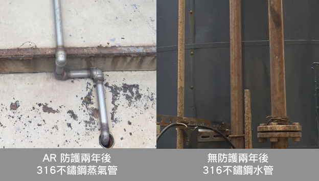
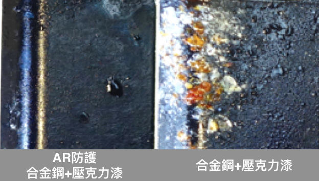
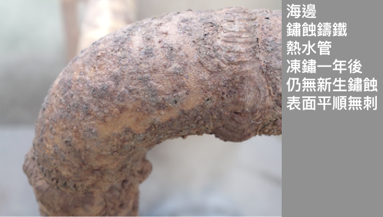
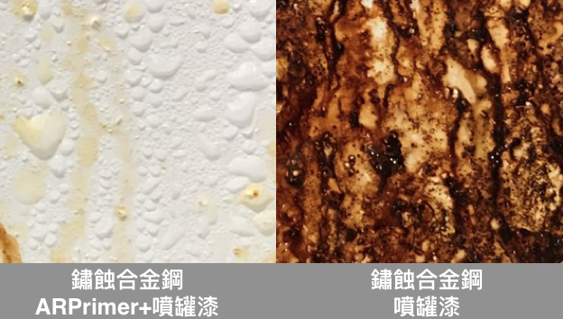
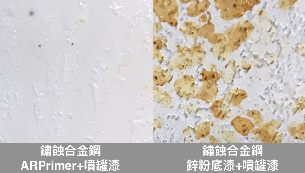
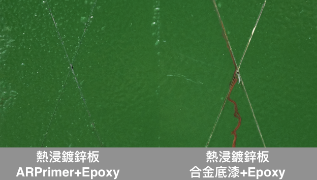
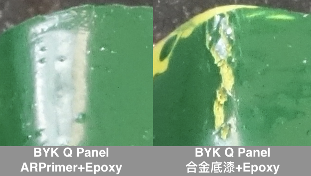

.. _h174fb648377959437b5c1f697c1c40:

技術驗證
########

.. _h621a43fb1c1a26452669741c642e:

SGS 三大驗證保障
================

成分符合RoHS，不含重金屬、施作無毒性，不含VOCs、膜層符合美國FDA標準（食品業可用）

|REPLACE1|

.. _h2c1d74277104e41780968148427e:

+--------------+-----------+----------+
|\ |IMG1|\     |\ |IMG2|\  |\ |IMG3|\ |
|              |           |          |
|RoHS Complaint|VOCs Free  |US FDA    |
|              |           |          |
+--------------+-----------+----------+

.. _h621a43fb1c1a26452669741c642e:

SGS 防鏽能力檢測
================

膜層厚度小於1μm，依ASTM B117 標準進行 500小時鹽水噴霧試驗，500小時通過

\ |IMG4|\ 

|REPLACE2|

.. _h6759752a2a4c4d7c582067552015e37:

防鏽能力-ARSealing 密封型透明防鏽劑
===================================

.. _h59785b9594bf4f553912667b766f29:

提高低階表面處理產品防鏽能力  (ASTM B117 NSS 432hrs)
----------------------------------------------------

\ |IMG5|\ 

.. _h7d4f3554605d4928465e353e62762066:

面漆封孔延長壽命不受鹽分濕氣侵蝕    (95%RH RT High Salt Contain Exposed 1,440hrs)
---------------------------------------------------------------------------------

\ |IMG6|\ 

.. _h371b32363655104e7f63456412d40c:

海邊316不鏽鋼管AR防鏽長期效果顯著，焊接處也無鏽
-----------------------------------------------

.. _h756a352c74f366066557d5675585624:

\ |IMG7|\ ----------

.. _h4893794c3f47f6f6c2280104a417e:

海邊鏽蝕法蘭凍鏽一年後不長新鏽    (觀音工業區, 台灣)
----------------------------------------------------

\ |IMG8|\ 

.. _h4893794c3f47f6f6c2280104a417e:

海邊鏽蝕熱水管凍鏽一年仍無新鏽    (觀音工業區, 台灣)
----------------------------------------------------

\ |IMG9|\ 

.. _h545f2d3c3794f561669591ee42462b:

防鏽能力-ARPrimer 底塗型透明防鏽劑
==================================

.. _h3338285ae436a1955216e541e4c4c65:

凍鏽後鹽霧360小時漆面完整不起泡    (ASTM B117 NSS 360hrs)
---------------------------------------------------------

\ |IMG10|\ 

.. _h07e6a5b7e3267223b193679c5b643b:

免除鏽取代鋅粉底漆增加防鏽能力    (ASTM B117 NSS 72hrs)
-------------------------------------------------------

\ |IMG11|\ 

.. _h39637d948521e7b7421411770577f7c:

提高漆料附著鹽霧432小時不流鏽水    (ASTM B117 NSS 432hrs)
---------------------------------------------------------

\ |IMG12|\ 

.. _hf7f746347312486fa67f437c7f69:

增加漆料附著彎折金屬底板不開裂    (ASTM D522 ∅2mm 45 degree)
------------------------------------------------------------

\ |IMG13|\ 

.. bottom of content

.. |REPLACE1| raw:: html

    
.. |REPLACE2| raw:: html

    
.. |IMG1| image:: static/Veri-test_1.png
   :height: 242 px
   :width: 172 px

.. |IMG2| image:: static/Veri-test_2.png
   :height: 225 px
   :width: 177 px

.. |IMG3| image:: static/Veri-test_3.png
   :height: 224 px
   :width: 176 px

.. |IMG5| image:: static/Veri-test_5.png
   :height: 341 px
   :width: 601 px

