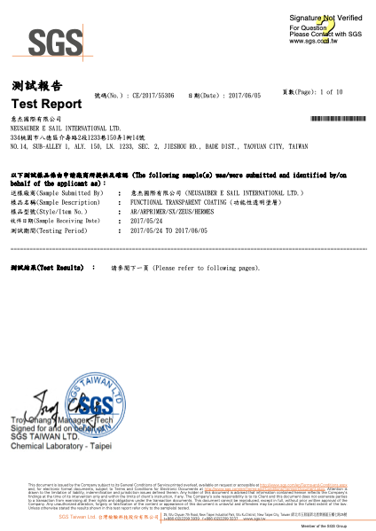
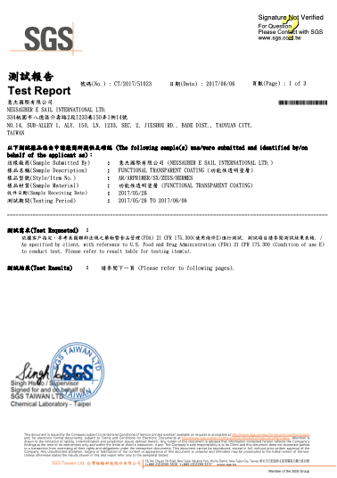

.. _h174fb648377959437b5c1f697c1c40:

技術驗證
########

SGS 三大驗證保障

成分不含重金屬、施作無毒性、膜層符合美國FDA標準（食品業可用）

|REPLACE1|

.. _h2c1d74277104e41780968148427e:

+--------------+-----------+----------+
|\ |IMG1|\     |\ |IMG2|\  |\ |IMG3|\ |
|              |           |          |
|RoHS Complaint|VOCs Free  |US FDA    |
|              |           |          |
+--------------+-----------+----------+

.. _h2c1d74277104e41780968148427e:

|REPLACE2|

防鏽能力

市售電白螺絲以AR透明防鏽劑防護 與 無任何防護 鹽霧測試 432小時比較

\ |IMG4|\ 

不除鏽直接使用ARPrimer凍鏽後噴漆 與 不除鏽直接噴漆 鹽霧測試240小時比較

\ |IMG5|\ 

.. bottom of content

.. |REPLACE1| raw:: html

    
.. |REPLACE2| raw:: html

    
.. |IMG1| image:: static/Veri-test_1.png
   :height: 242 px
   :width: 172 px

.. |IMG4| image:: static/Veri-test_4.png
   :height: 361 px
   :width: 542 px

.. |IMG5| image:: static/Veri-test_5.png
   :height: 282 px
   :width: 544 px
