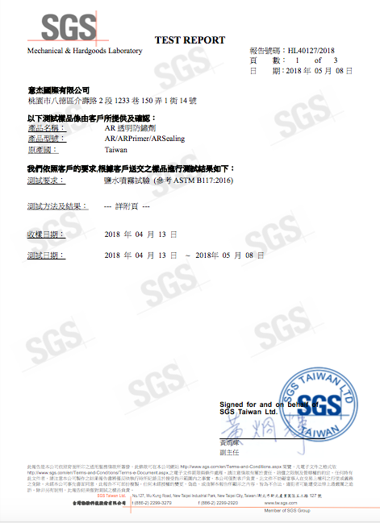

.. _h772f1c6b79252c7105d671b47493850:

產品驗證及Q&A
#############

.. _h695b1c504593418786e70441e2a5911:

SGS 驗證保障
============

成分符合RoHS，不含重金屬、施作無毒性，不含VOCs、膜層符合美國FDA標準（食品業可用）

|REPLACE1|

.. _h2c1d74277104e41780968148427e:

|REPLACE2|

.. _h621a43fb1c1a26452669741c642e:

SGS 防鏽能力檢測
================

鍍鋅底板，ARSealing膜層厚度小於1μm，依ASTM B117 標準進行 500小時鹽水噴霧試驗通過

 \ |IMG4|\ 

.. _h44272b321b7648e4344803c5f193a40:

Q&A
===

.. _h5c462122702e7cc06763134049d56:

金屬鏽蝕怎麼開始？
------------------

A：眼睛看到的鏽都只是一連串反應的結果。鏽蝕反應是金屬被水中的氫氧基(OH-)啟動而開始，鏽蝕反應啟動後，鏽蝕活性就會在新鮮金屬間傳遞，接收到鏽蝕活性的金屬就變成奈米等級的鏽，又奈米鏽有非常多微孔洞，因毛細現象吸收更多空氣中的水氣，解離出越多氫氧基來啟動更多新鮮金屬轉成奈米鏽，不斷累積後就變成我們可以看到的鏽蝕。因此水與鏽蝕活性是防鏽首先要處理的兩個因素。

.. _h2276373c576d1c241659471e414b00:

是不是只要無氧無水就可以防鏽？
------------------------------

A：理想狀態是這樣沒錯，但因為空氣中一定含有水氣(濕氣)，新鮮金屬只要接觸到水氣就會立刻轉成眼睛看不見的奈米鏽，奈米鏽內的多孔會因毛細現象蓄涵豐富水分，即使用包覆良好的塗層將金屬包起來隔絕外部的水與氧，內部奈米鏽中的水份也會解離成氫氧基(OH-)啟動鏽蝕反應，之後氫氧基中的氧(O)就成為氧的來源造成生鏽。因此若沒有使用適當的前處理把奈米鏽的鏽蝕活性與水分處理掉，鏽蝕就會不斷發生。使用AR透明防鏽劑即可同時鈍化鏽蝕活性與排除水分，讓金屬保持最穩定狀態，進行後道塗裝或其他防鏽處理。

.. _h417737732f18171e7b3f2567d12025:

為何作防鏽前要先除鏽？要除到什麼情況？
--------------------------------------

A：過去的防鏽工法要求除鏽一定要見到金屬銀灰色表面的程度，是為確保沒有鏽層與其內含的水份，留下會造成鏽蝕因子。但這忽略了新鮮金屬只要接觸空氣中的濕氣就會產生奈米鏽，因此一段時間後鏽蝕就會復發。若使用AR透明防鏽劑前處理即可克服除鏽後鏽蝕復發的問題。

.. _h471d1253d751a2c4465794a4e7c5a7c:

除鏽後使用鋅粉漆的功效如何？
----------------------------

A：鋅粉漆在原理上利用電位差吸引金屬間傳遞的鏽蝕活性並予以結合鈍化。但實務上金屬表面的奈米鏽或鏽層為絕緣材質，一但有其阻隔則鏽蝕活性將無法由金屬端傳遞至鋅粉端進而結合鈍化，因此使用鋅粉漆來作為鈍化鏽蝕活性達到優良防鏽並沒有期待的長久有效。AR透明防鏽劑可滲入鏽蝕最底層，主動鈍化鏽蝕活性，排出水分避免鏽蝕再度復發。

.. _hd7b751276e3b5a272340277219674:

紅丹漆防鏽效果最好？
--------------------

A：紅丹漆過去是利用氧化鉛的強氧化性鈍化鏽蝕內的水與活性達成優良的抑鏽效果，但因鉛會造成人體傷害，近年來已無法使用氧化鉛作為紅丹漆的原料，所以紅丹漆的抑鏽效果已大不如前。且紅丹漆韌性高，使用後一旦鏽蝕很難以研磨機磨除，造成後續去除殘漆的困擾。AR透明防鏽劑不含鉛、鎘、汞、六價鉻等重金屬，透過氧化還原主動鈍化鏽蝕活性，更可增加後道塗裝附著性，提高整體防鏽能力。

.. _h507524361a55b2f195d763e73767f36:

鏽轉化劑好用嗎？
----------------

A：鏽轉化劑是利用酸性物質強迫鏽層再度脫水氧化，使得鏽層轉變成陶瓷相的金屬氧化物，所以僅能應用在生鏽的表面，沒有生鏽的表面使用反而會加速鏽蝕。除施作過程有異味產生外，形成的新陶瓷相金屬氧化物與原金屬的熱膨脹係數差距大，經環境溫度變化的幾次熱脹冷縮循環後會產生兩者脫層分離，此時就會讓空氣與水氣滲入再度鏽蝕。AR透明防鏽劑僅針對鏽蝕活性進行結合鈍化，並充填鏽裡的多孔層，使用後不但鏽不會與金屬脫層，更能增強鏽層結構，轉化成絕不脫層又緻密的防鏽保護層。而且不管生鏽或沒有生鏽的表面都可使用。

.. _h106d6a60386b4471802c17574203f54:

無法除鏽的地方怎麼辦？
----------------------

A：以現在通用的工法來說，沒有除鏽後續就無法有效的防鏽，因此常見到在鋼纜、螺栓、鐵管等不能除鏽、或難以除鏽的地方只能塗塗鋅粉漆安慰自己，但我們都知道那是無效的。AR透明防鏽劑正是因應這個問題而生，使用前無須除鏽即可發揮凍鏽效果，使得鏽不再具有活性也無水分生成新鏽蝕，完全解決無法除鏽卻需要優良防鏽的窘境。

.. _h4a25930737a3b6342803154b595d5a:

為何鏽都容易發生在端點或裁切處？
--------------------------------

A：金屬的端點包含終端、彎折等位置，金屬內電子容易往這裡流動集中，因此相對於其他部位，這些位置更容易生鏽。裁切處除也是端點位置外，也因經過裁切露出金屬無經過任何表面處理之剖面，因此比所有部位更容易生鏽。無論任何金屬表面或部位，AR透明防鏽劑都可增強其防鏽能力，延長使用年限。

.. _h471d1253d751a2c4465794a4e7c5a7c:

為何鏽都反覆發生在相同位置？
----------------------------

A：金屬生鏽後所產生的鏽蝕活性，若沒有經過鈍化處理會持續存在不會消失，而目前工法並沒有適用的鈍化處理，因此鏽蝕都會在相同位置不斷反覆發生。AR透明防鏽劑不論在室內、戶外，或有除鏽、沒除鏽都可以簡單對易鏽蝕部位進行凍鏽鈍化，讓鏽蝕不再發生。

.. _h65a754d314849631d4f1770f68746b:

焊接的位置為何常最快生鏽？
--------------------------

A：焊接需要產生高溫才能讓金屬熔合在一起，降溫後相對於原本的緻密的金屬表面，因混入空氣氣泡及排列混亂的晶格，使得熱影響區結構較為鬆散防鏽效果自然遠遜於緻密表面，再加上降溫過程中與空氣中的濕氣進行熱交換，便產生大量奈米鏽因而加速了焊接處的鏽蝕速度。使用AR透明防鏽劑即可為鈍化奈米鏽與增強防鏽能力，解決焊接位置特別容易生鏽的問題。

.. _h57574e4f5e306a1f6a391d2041155b23:

有可以不用除鏽的工法嗎？
------------------------

A：AR透明防鏽劑不論在室內、戶外，或有無進行除鏽都可以簡單對易鏽蝕部位進行凍鏽鈍化，讓鏽蝕不再發生。

.. _h4a25930737a3b6342803154b595d5a:

海邊是不是用不鏽鋼就不會生鏽了？
--------------------------------

A：不鏽鋼是利用成分中的鉻析出至表面形成氧化鉻保護表面，然而氧化鉻對氯的忍受力較差，因此在氯離子多的海邊反而容易因此而被侵蝕生鏽。使用AR透明防鏽劑可以進一步保護氧化鉻不受氯離子侵蝕，因此能有效保護及延長不鏽鋼在海邊的防鏽效果及壽命。

.. _h6a54293d7e5e2869d6d657639102828:

想留下鏽的外觀又不會繼續生鏽怎麼做？
------------------------------------

A：鏽蝕具有活性及水分，只要將這兩個因素排除就可留下質樸的鏽蝕外觀，而不會繼續侵蝕底下的金屬層。AR透明防鏽劑透過獨家凍鏽技術鈍化鏽蝕活性，填充鏽蝕內的孔洞擠出水分，解決鏽蝕最重要的兩的因素，且不會造成材質外觀上的巨大改變，因此可只留下鏽蝕外觀，卻不會繼續生鏽。

.. _h2276373c576d1c241659471e414b00:

為何使用鋅粉底漆不久後仍鏽蝕？
------------------------------

A：鋅粉漆在原理上利用電位差吸引金屬間傳遞的鏽蝕活性並予以結合鈍化。但實務上金屬表面的奈米鏽或鏽層為絕緣材質，一但有其阻隔則鏽蝕活性將無法由金屬端傳遞至鋅粉端進而結合鈍化，因此使用鋅粉漆沒多久又會再度發現鏽蝕。AR透明防鏽劑可滲入鏽蝕最底層，主動鈍化鏽蝕活性，排出水分避免鏽蝕再度復發。

.. _h65a754d314849631d4f1770f68746b:

已採用熱浸鍍鋅還是會生鏽？
--------------------------

A：熱浸鍍鋅讓工件表面形成一層豐富易鏽的自我犧牲鋅層，鋅一但生鏽氧化後會形成自我縮合的粒子狀，不容易讓鏽蝕活性傳遞至新鮮金屬層造成鏽蝕擴散，因此可達到優良的防鏽效果，一旦表面鋅層被消耗完後，就失去保護底層金屬的能力。不同環境對鋅層的消耗速度不同，海邊含氯或溫泉區含酸的環境消耗速度最快，因此多再用塗層保護減緩鋅層的消耗，然而塗層很難在鋅層的表面密著，因此若處理不當容易造成兩者鬆脫，反而加速鋅層的消耗。使用AR透明防鏽劑除可保護鋅層不易消耗外，更能增加塗層與鋅層間的密著，達到應有防護與防鏽的效果。

.. _h106d6a60386b4471802c17574203f54:

哪種塗料防鏽效果最好？
----------------------

A：每一種塗料都有其對應環境與需求，並沒有最好或最壞之分。而防鏽最重要的在於是否有前處理能鈍化鏽蝕的活性，與除去潛藏的水分，只要能做好此前處理，每一種塗料都可達到其最佳的防鏽狀態。AR透明防鏽劑獨家凍鏽鈍化技術、排除水分能力可扮演各種塗料或需求最佳前處理劑角色。

.. _h5c462122702e7cc06763134049d56:

最省錢的防鏽方法？
------------------

A：AR透明防鏽劑僅需要清潔不需要除鏽就可以施作，即使在海邊施作後亦可達到數年以上之防鏽效果。

.. _h5c462122702e7cc06763134049d56:

最省工的防鏽方法？
------------------

A：AR透明防鏽劑僅需要清潔不需要除鏽就可以施作，在高處、危險地帶、或有時間限制的區域可快速施作完成，減少交維、吊車、或施作時間等花費，及減少工安風險。

.. _h2276373c576d1c241659471e414b00:

防鏽要做三道、五道、還是七道？
------------------------------

A：施作越多道對外來鏽蝕因素，如雨水、鹽分等的防鏽越好。但來自內部的鏽蝕因素，如已存在的鏽蝕活性與水分則需要在施作前有良好的前處理才能防止。AR透明防鏽劑為目前最好的前處理劑，可鈍化鏽蝕活性，擠出鏽蝕內水分，防止內部存留的鏽蝕因素造成的生鏽。

.. _h106d6a60386b4471802c17574203f54:

什麼方法可以永不生鏽？
----------------------

A：沒有！所有的防鏽工法都是預防性、或事後補救處理，只有防鏽壽命的差別，沒有永不生鏽的工法，特別是不同環境對防鏽產品的侵蝕性也不同，建議設定固定的維護週期並確實執行，保證金屬工件或設施的長久使用與安全。

.. _h74205336266b4c341438216f554f2042:

為何使用AR透明防鏽劑前不除鏽更好？
----------------------------------

A：鏽本身與金屬以原子鍵鍵結，就算以電動研磨機也需極費力氣與時間才能將之去除。因此使用AR透明防鏽劑除可鈍化鏽蝕活性外，亦會填充鏽層內的多孔及強化結構，使鏽層變成完美的防鏽無機保護層，不會與金屬脫離也不易受到紫外線、水、鹽分、酸氣的影響而失去防鏽效果。

.. _h5a4f2e7e2b495e2e407a751e4d773158:

已經有熱浸鍍鋅了還需使用AR透明防鏽劑嗎？
----------------------------------------

A：不同環境對鋅層的消耗速度不同，海邊含氯或溫泉區含酸的環境消耗速度最快，因此多再用塗層保護減緩鋅層的消耗，然而塗層很難在鋅層的表面密著，因此若處理不當容易造成兩者鬆脫，反而加速鋅層的消耗。使用AR透明防鏽劑除可保護鋅層不易消耗外的ARSealing版本，亦有能增加塗層與鋅層間密著的ARPrimer版本，達到應有防護與防鏽的效果。

.. _h243812725d2f2a233c3966571041676a:

已經有塗層了還需使用AR透明防鏽劑嗎？
------------------------------------

A：塗層在固化過程中為放熱反應，會留下許多深邃不會癒合的毛細孔，因有濕氣而產生毛細現象，若有紫外線更幫助毛細孔裡的水反應加速塗層粉化，或有紅外線、或氣溫變化造成熱脹冷縮破壞塗層結構加速劣化。AR透明防鏽劑可滲入並填充這些毛細孔，不再有水氣造成塗層粉化與劣化，更能折射並減少吸收紫外線、紅外線，延長塗層防鏽壽命。

.. _h204e3e5f6946a384e565b96212613:

AR透明防鏽劑各版本如何使用？
----------------------------

A：ARSealing具有凍鏽與防鏽雙重功能，可鈍化鏽蝕活性，並排出鏽層中的水分，又可在表面形成連續性保護膜層，因此只需施作一道即可，適合用於可留下鏽蝕外觀，又需要防鏽的地方。

ARPrimer具有凍鏽與增加塗料密著的功能，可鈍化鏽蝕活性，並排出鏽層中的水分，但不會形成連續性保護膜層，一定需要再塗上具防鏽保護性塗層，因此施作順序為先使用ARPrimer再上塗層，適合不能看到鏽蝕外觀或需顏色管理的區域。

因兩個版本皆有凍鏽功能，使用ARSealing前不需要使用ARPrimer。但若已使用ARPrimer及塗裝後，為增加塗裝的防鏽能力或塗層的壽命，可再使用ARSealing為最上層保護。

|REPLACE3|

.. bottom of content

.. |REPLACE1| raw:: html

    
.. |REPLACE2| raw:: html

    <table cellspacing="0" cellpadding="0" style="width:100%">
    <tbody>
    <tr><td style="text-align:center;width:31%;vertical-align:Top;padding-top:5px;padding-bottom:5px;padding-left:5px;padding-right:5px;border:solid 1px #000000">

RoHS Complaint

</td><td style="text-align:center;width:34%;vertical-align:Top;padding-top:5px;padding-bottom:5px;padding-left:5px;padding-right:5px;border:solid 1px #000000">

VOCs Free
</td><td style="text-align:center;width:34%;vertical-align:Top;padding-top:5px;padding-bottom:5px;padding-left:5px;padding-right:5px;border:solid 1px #000000">

US FDA
</td></tr>
    </tbody></table>

.. |REPLACE3| raw:: html

    
.. |IMG1| image:: static/Veri-test_1.jpeg
   :height: 246 px
   :width: 172 px

.. |IMG2| image:: static/Veri-test_2.jpeg
   :height: 273 px
   :width: 192 px

.. |IMG3| image:: static/Veri-test_3.jpeg
   :height: 273 px
   :width: 192 px

