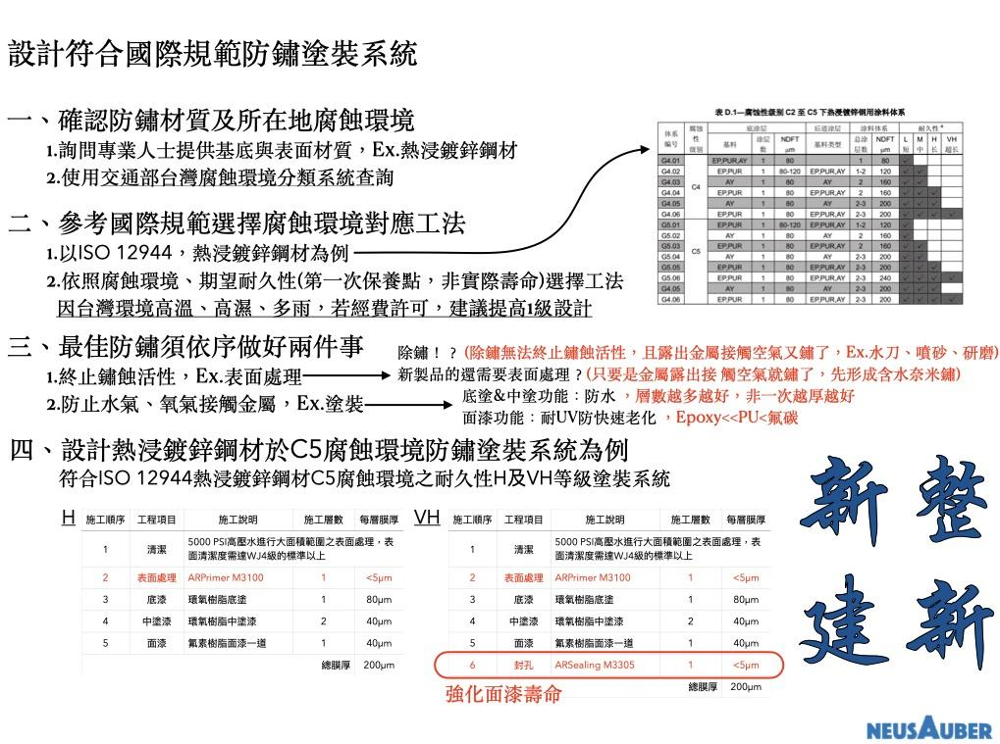
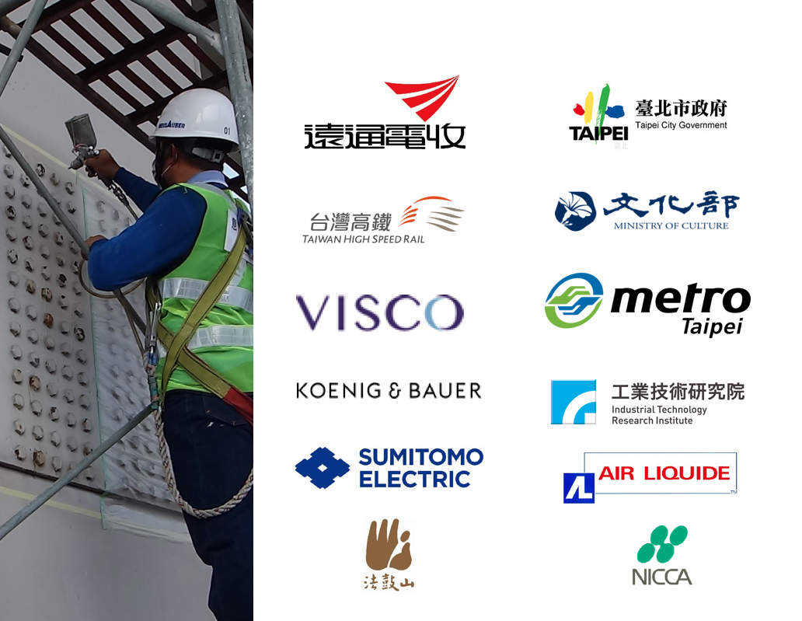
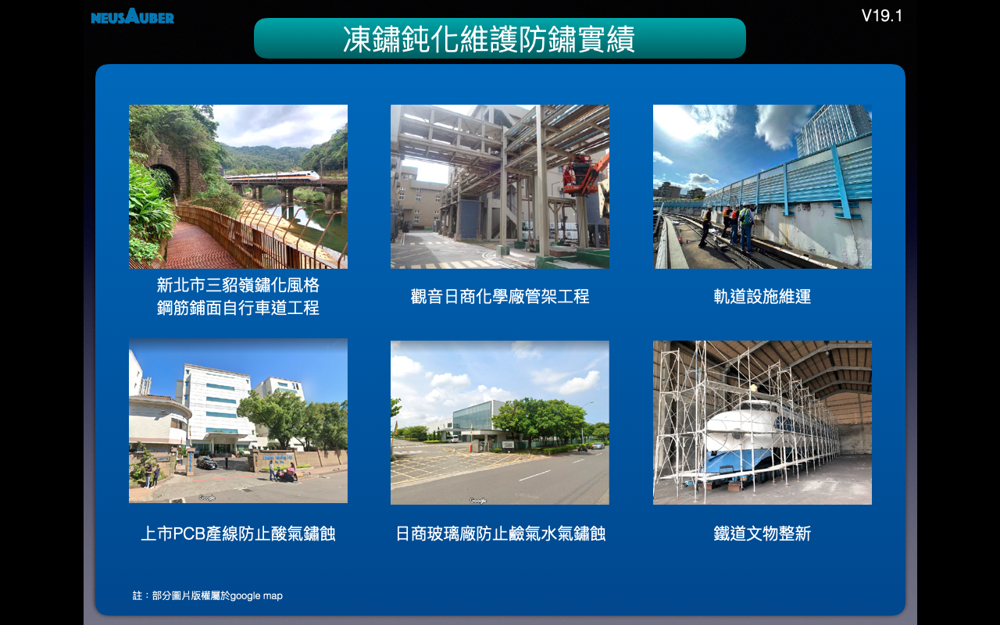
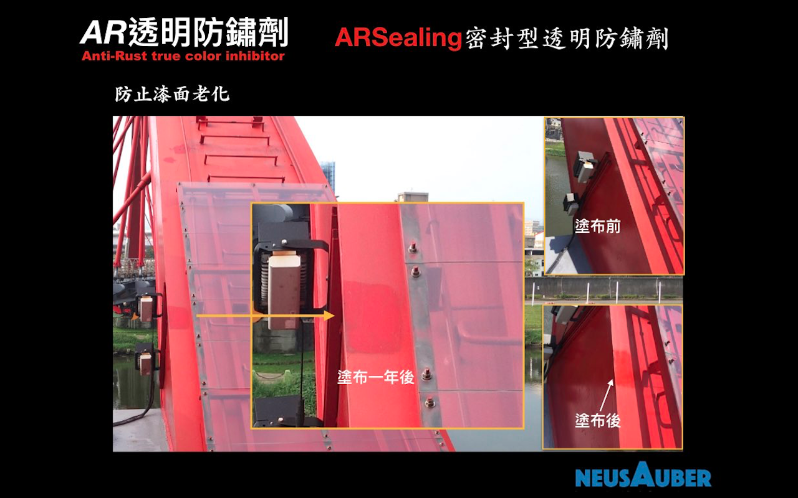
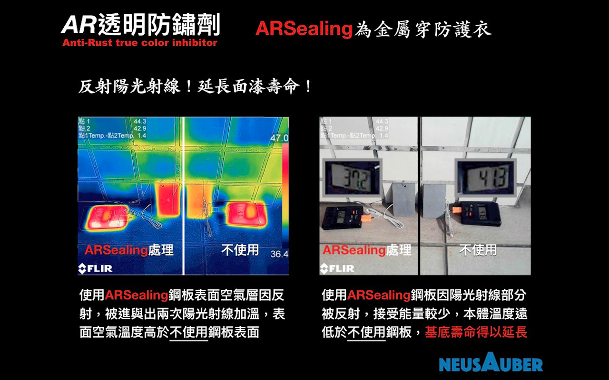
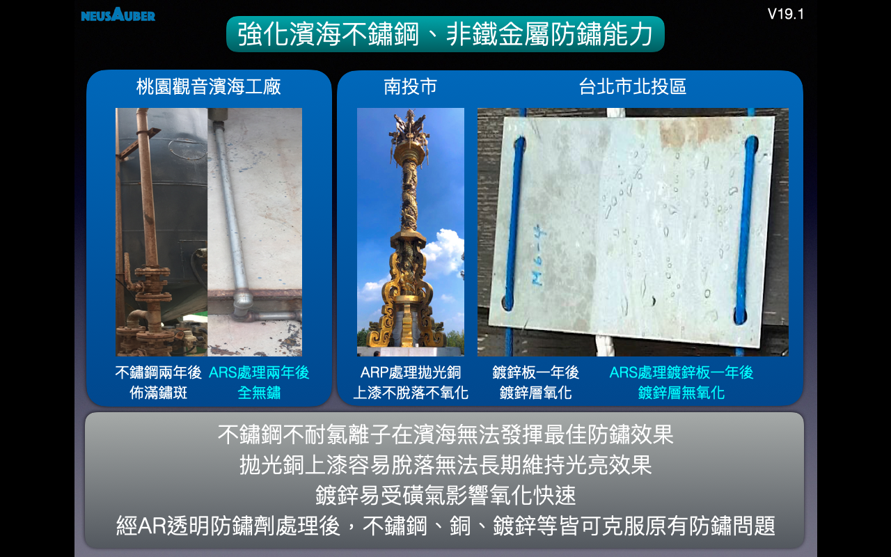
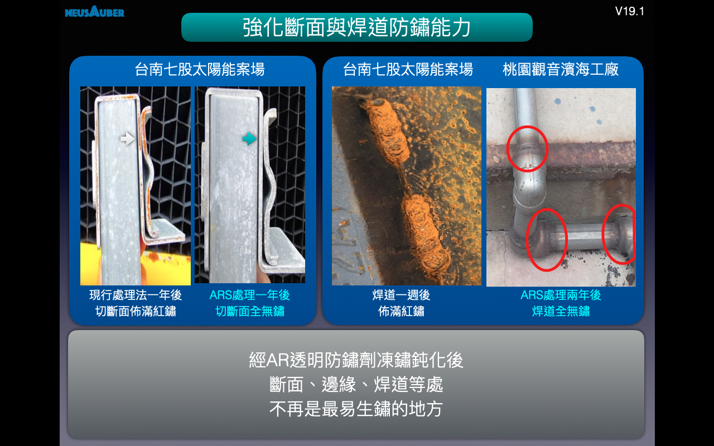
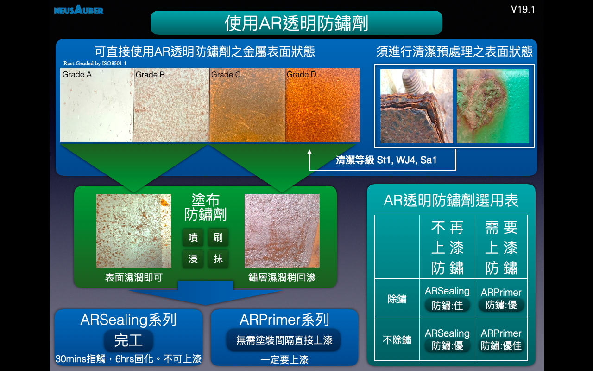
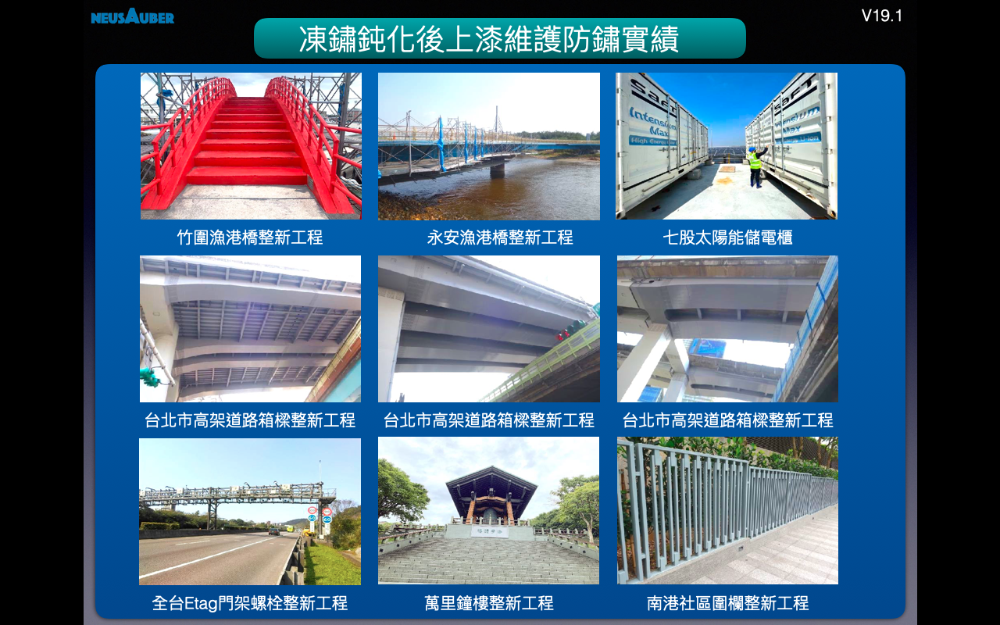
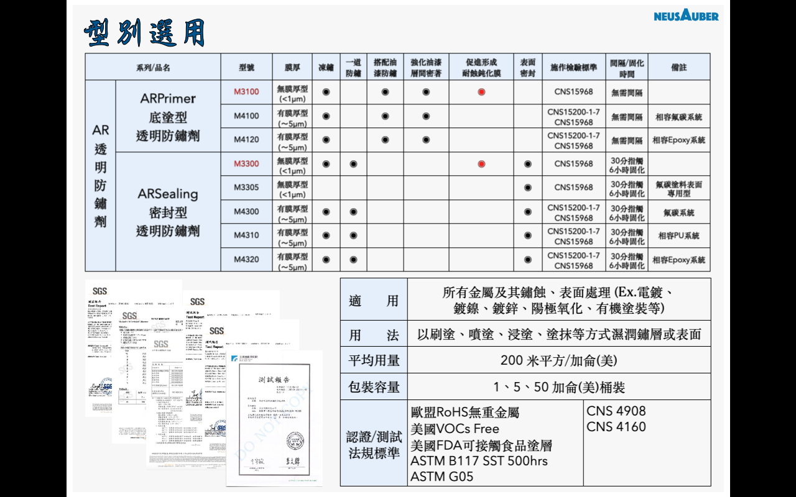

.. _h6d226b6080575179171220c73657b3e:

\ |LINK1|\  - 鏽蝕終結者
########################

.. toctree:: 
    :maxdepth: 2
    :hidden:

    Home
    Products
    Demo
    Veri-test
    Contact
    About

.. _h761c451d126f4e1d335c376911446c4:

最新消息 
=========

.. _h691b354056506d1415553645c657a58:

2021年3月5日出刊 台灣省土木技師公會技師報1264期文章
===================================================

『\ |LINK2|\ 』

海上或濱海嚴苛C5以上環境使用AR透明防鏽劑之ARPrimer，即使表面塗裝因故失效後仍可保護金屬層不會快速鏽蝕與擴散，不但強化防鏽效果更延長保護時間，減少損壞與後續維護產生之高額損失

.. _h92a51766d352b72667e543a1c125a71:

2020年10月11日11點撥出年代電視『點亮新台灣』節目專訪
====================================================

|REPLACE1|

\ |STYLE0|\ 

\ |STYLE1|\ 

\ |STYLE2|\ 

\ |STYLE3|\ 

\ |STYLE4|\ 

\ |STYLE5|\ 

\ |STYLE6|\ 

\ |STYLE7|\ 

.. admonition:: “凍鏽”能做什麼？

    \ |IMG1|\ \ |IMG2|\ 

.. admonition:: “凍鏽”效果

    \ |IMG3|\ \ |IMG4|\ 

\ |STYLE8|\ 。

.. _h2c1d74277104e41780968148427e:

.. _h174fb648377959437b5c1f697c1c40:

系列產品
========

.. admonition:: 產品列表

    \ |IMG5|\ \ |IMG6|\ 

\ |STYLE9|\ 

具有凍鏽、密著底漆功能之透明防鏽劑，可取代傳統所有底漆，如紅丹、合金底漆、鋅粉底漆、鏽轉化劑等，及提高面漆附著的功能。使用ARPrimer後不必等待固化，可直接施作所有種類面漆，達到凍鏽與防鏽功能。

.. admonition:: ARPrimer

    \ |IMG7|\ \ |IMG8|\ 

\ |STYLE10|\ 

同時具有凍鏽又防鏽雙效功能，只要施作一道，不必搭配ARPrimer底塗使用，即可保留鏽蝕外觀又兼具防鏽效果。

.. admonition:: ARSealing

    \ |IMG9|\ \ |IMG10|\ 

.. _h174fb648377959437b5c1f697c1c40:

使用方式
========

.. admonition:: 使用方式

    \ |IMG11|\ \ |IMG12|\ 

.. _h174fb648377959437b5c1f697c1c40:

防鏽能力
========

通過國際鑽油平台防蝕標準 Norsok M501，適用 C5M 或 Im2 腐蝕環境。

.. admonition:: 可依需求選擇對應防鏽工法

    \ |IMG13|\ 

＊實際年限以各地區環境為準。

.. _h174fb648377959437b5c1f697c1c40:

案例分析
========

.. admonition:: 高速公路工程案例

    \ |IMG14|\ 

.. _h365425373c54557813239715c73338:

AR透明防鏽劑防護中
==================

.. admonition:: 知名案例

    \ |IMG15|\ 

.. admonition:: 諮詢聯絡資訊

    AR透明防鏽劑
    使用諮詢，工作日週一～週五 09:00~17:30
    
    請聯絡
    意杰國際 03-3659119 葉先生
    
    \ |LINK3|\ 
    
    Line ID:@345rxpyp
    
    \ |IMG16|\ 
    
    (Line ID QR code)
    
    注意事項：
    
    請使用上列電子郵件或加入Line官方帳號詢價訂購，恕不提供店頭或門市銷售；訂購價格『已含運費』並以郵局或大榮貨運遞送；一般狀況下依訂購數量約3~7工作日內可收到貨。

.. admonition:: 詢價與使用建議、訂購流程：

    1.詢價與使用建議
    
    請於電子郵件或Line官方帳號提供下列資訊
    
    公司名(個人)： 
    
    聯絡人： 
    
    聯絡電話： 
    
    預計使用物件、狀態、面積： 
    
    該物件地理環境或地點： 
    
    最終希望塗裝或不需要塗裝： 
    
    2.訂購
    
    請於電子郵件或Line官方帳號提供下列資訊
    
    公司名(個人)： 
    
    統編： 
    
    收件人： 
    
    收件地址： 
    
    聯絡電話： 
    
    訂購型號： 
    
    包裝及數量： 
    

.. _h6f15a413cb3d267b3e4f1c74347521:

\ |LINK4|\ 
===========

.. _h506384e4438e4c26493b8112d2617:

\ |LINK5|\ 
===========

(權利聲明：Neusauber、AR透明防鏽劑 為意杰國際註冊商標)

|REPLACE2|

.. bottom of content

.. |STYLE0| replace:: **AR透明防鏽劑**

.. |STYLE1| replace:: **為溶劑型淡黃色無黏度透明化學溶液，滲透性、擴展性極佳，專門針對室內外既有金屬設施之前處理或表面處理劑。不需要除鏽即可終止鏽蝕活性、或提供長效防鏽、增加各式塗層密著與其壽命之功能。非油漆、油脂或鏽轉化劑系統。**

.. |STYLE2| replace:: **以獨家凍鏽技術，滲入鏽蝕最底部主動結合具反應活性的金屬離子，隨即終結與凍結鏽蝕反應，該處將不再持續鏽蝕，達到極佳防鏽效果。**

.. |STYLE3| replace:: **經凍鏽後原鏽層即為高硬度、附著極佳與覆蓋完整之最理想無機保護層，防護金屬避免再度氧化。**

.. |STYLE4| replace:: **施作簡單、快速，防鏽效果佳、壽命長。工研院與SGS檢測，材料安全環保，同時符合 CNS4908 、與 CNS4160 標準，膜層具美國FDA食品級塗層認證，更通過國際 ASTM B117 及 Norsok M501 防鏽能力測試。**

.. |STYLE5| replace:: **AR透明防鏽劑有可於塗裝前、塗裝間使用的ARPrimer 底塗型透明防鏽劑。塗裝前使用提供凍鏽及增加金屬與塗料密著功能，塗裝間使用提供塗料與塗料密著功能。建議ARPrimer與塗料噴塗一前一後雙工同時施作，可發揮最大防鏽或塗料密著功效。**

.. |STYLE6| replace:: **AR透明防鏽劑也有不需後塗裝或塗裝後使用的ARSealing 密封型透明防鏽劑。直接使用不需後塗裝，即可同時提供凍鏽、防鏽雙效功能。塗裝後使用可提供塗層耐UV抗粉化、提高防鏽壽命等功能。.**

.. |STYLE7| replace:: **橋樑、建築、動力車輛/底盤、機械設備、太陽能、風力發電、化學管線/槽/架、室內物品、食品設備、自行車等防鏽，所有室內、室外、高鹽害、高磺害之金屬設施或設備都適用，無法除鏽、除鏽困難區域更合適。鐵材、鋼材、鋼纜、銅製、鋁製、鎳鍍層、鋅鍍層、油漆層皆可用。**

.. |STYLE8| replace:: **經AR凍鏽後不僅無需除鏽，且防鏽能力至少提高兩倍以上**

.. |STYLE9| replace:: **ARPrimer底塗型透明防鏽劑**

.. |STYLE10| replace:: **ARSealing密封型透明防鏽劑**

.. |REPLACE1| raw:: html

    <iframe width="100%" height="480" src="https://www.youtube.com/embed/sjp9d_hZdBQ
    " frameborder="0" allow="autoplay; encrypted-media" allowfullscreen></iframe>
.. |REPLACE2| raw:: html

    

.. |LINK1| raw:: html

    <a href="https://drive.google.com/file/d/1coUftMdMeSQzrqqtFDNID4MvLiWsBYsP/view?usp=sharing" target="_blank">AR透明防鏽劑</a>

.. |LINK2| raw:: html

    <a href="http://etimes.twce.org.tw/%E6%96%BD%E5%B7%A5%E6%8A%80%E8%A1%93/3197-%E4%BB%A5%E8%A1%A8%E9%9D%A2%E8%99%95%E7%90%86%E6%94%B9%E5%96%84%E7%86%B1%E6%B5%B8%E9%8D%8D%E9%8B%85%E5%A1%97%E8%A3%9D%E9%98%B2%E9%8F%BD%E8%83%BD%E5%8A%9B%E4%B9%8B%E6%8E%A2%E8%A8%8E.html" target="_blank">以表面處理改善熱浸鍍鋅塗裝防鏽能力之探討</a>

.. |LINK3| raw:: html

    <a href="mailto:service@neusauber.com">service@neusauber.com</a>

.. |LINK4| raw:: html

    <a href="https://drive.google.com/file/d/1coUftMdMeSQzrqqtFDNID4MvLiWsBYsP/view?usp=sharing" target="_blank">AR透明防鏽劑DM下載</a>

.. |LINK5| raw:: html

    <a href="https://drive.google.com/file/d/17b1v2S6ZBy7BIJ1ijb25DQSpF2hZA0Xh/view?usp=sharing" target="_blank">AR透明防鏽劑簡報資料下載</a>

.. |IMG1| image:: static/index_1.jpeg
   :height: 509 px
   :width: 682 px

.. |IMG2| image:: static/index_2.jpeg
   :height: 509 px
   :width: 682 px

.. |IMG4| image:: static/index_4.jpeg
   :height: 512 px
   :width: 682 px

.. |IMG6| image:: static/index_6.jpeg
   :height: 509 px
   :width: 682 px

.. |IMG12| image:: static/index_12.png
   :height: 426 px
   :width: 682 px

.. |IMG15| image:: static/index_15.jpeg
   :height: 509 px
   :width: 682 px

