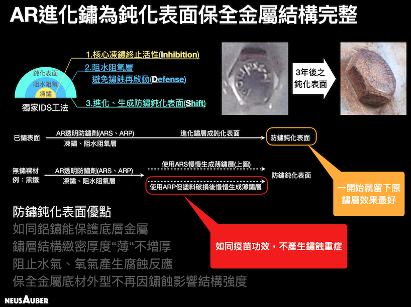

.. _h461161d721637113f68205a12497637:

Neusauber AR透明防鏽劑
######################

.. toctree:: 
    :maxdepth: 2
    :hidden:

    About
    Products
    Demo
    Veri-test
    Contact

|REPLACE1|

.. _h475c3f1a256741e29206e1471131f2a:

🥇台灣高速公路遠通電收ETC電子收費設備門架防鏽改善工程
-----------------------------------------------------

免除鏽之ARPrimer底塗凍鏽＋面漆保護工法，通過中興工程、高公局嚴格審驗，效果遠優於先除鏽並使用鋅粉底漆傳統工法，決定全線施作

\ |IMG1|\ 

.. _h79c6077c41304c4a7849a4f396c53:

”金屬從它被製造出來的當下就開始鏽蝕“ ... Matthew R. Simmons,國際知名能源基金創辦人 
-----------------------------------------------------------------------------------

過去的防鏽理論除了先要求把鏽除乾淨或塗上防堵型止鏽漆之外，更要求使用非常厚實的塗料包裹金屬，避免外來因素造成金屬鏽蝕。

但實務上的除鏽工法卻是造成金屬裸露及快速鏽蝕的主因之一，例如水刀除鏽或噴砂除鏽。而常見的水刀除鏽甚至有無法到達的角度限制，實際除鏽率平均僅有90%，仍有10%被裹入塗層中，甚至沒有處理，而且還沒計算水造成的表面水鏽。噴砂除鏽，雖然可以達到極高的除鏽率，但在高濕度環境的台灣，若沒有在半小時至一小時內上漆保護，表面即會大量生成黑色鏽點，而實務上幾乎難以達成。況且還有許多無法使用任何除鏽工法的情況。

雖然除鏽後會先使用自我犧牲金屬粉或防堵型的油漆作為第一道防線，但也僅有與鏽層表面接觸的金屬粉可發揮作用，一但表層消耗完，其他包在樹酯裡的出不來根本無用武之地，而鏽蝕的活性從來就沒有被消滅，甚至往金屬內層大舉邁進（如下圖）。

\ |IMG2|\ 

而厚實的塗料更大大延後這些鏽蝕被發現的時間點，每個鐵離子變成氧化鐵體積會膨脹40~50%，等到鏽蝕總體積大到足以突破這厚實塗層時，相對的它已經往金屬的內部侵蝕的更深，反而令欲保護的金屬損失更多，大幅減少使用壽命。

.. _h316a4a4976171e6d55256a1d5986334:

意杰國際Neusauber團隊，開發凍鏽技術，主動對鏽蝕活性進行凍結，使鏽蝕反應停止之系列產品 “AR透明防鏽劑”，藉以改善或補足現行防鏽理論的盲點與實務執行的難度，達到防鏽應有的設計壽命。
================================================================================================================================================================================

使用AR透明防鏽劑系列-不用除鏽，取代紅丹、鋅粉底漆，提高原有防鏽壽命3倍

SGS檢驗符合RoHS，完全不含重金屬，無VOCs，符合美國FDA食品容器塗層標準。

➤型號：AR透明防鏽劑

 功能：凍鏽、防鏽

 特點：

 1.凍鏽後鏽層不再侵蝕金屬，不會膨脹起泡

 2.免除鏽，塗完就收工，30分鐘後防護生效

 3.透明膜層不改變外觀，各種表面皆可施作

 4.防止水氣、鹽分、硫氣、酸氣侵蝕

 5.提高面漆或原有表面處理防鏽能力3倍

 6.新品、已鏽蝕表面皆可使用

➤型號：ARPrimer底塗型透明防鏽劑

 功能：凍鏽、提高漆料附著、取代底漆

 特點：

 1.凍鏽後鏽層不再侵蝕金屬，不會膨脹起泡

 2.事前免除鏽、免等固化，塗完直接上面漆

 3.增加塗料防返鏽壽命3倍

 4.取代合金底漆、紅丹底漆、鋅粉底漆

 5.提高熱浸鍍鋅表面漆料附著能力

 6.達到面漆原有設計防鏽壽命

|REPLACE2|

.. bottom of content

.. |REPLACE1| raw:: html

    <iframe width="100%" height="480" src="https://www.youtube.com/embed/74AgCrS-xtU" frameborder="0" allow="autoplay; encrypted-media" allowfullscreen></iframe>
.. |REPLACE2| raw:: html

    
.. |IMG1| image:: static/index_1.jpeg
   :height: 508 px
   :width: 684 px

