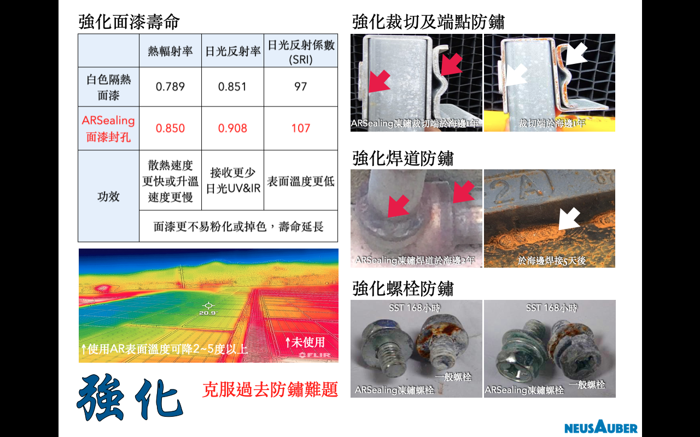

.. _h6d226b6080575179171220c73657b3e:

\ |LINK1|\  - 鏽蝕終結者
########################

.. toctree:: 
    :maxdepth: 2
    :hidden:

    Home
    Products
    Demo
    Veri-test
    Contact
    About

\ |STYLE0|\ 

\ |STYLE1|\ 

\ |STYLE2|\ 

\ |STYLE3|\ 

|REPLACE1|

.. _h2c1d74277104e41780968148427e:

.. _h174fb648377959437b5c1f697c1c40:

系列產品
========

|REPLACE2|

\ |STYLE4|\ 

具有凍鏽、密著底漆功能之透明防鏽劑，可取代傳統所有底漆，如紅丹、合金底漆、鋅粉底漆、鏽轉化劑等，及提高面漆附著的功能。使用ARPrimer後不必等待固化，可直接施作所有種類面漆，達到凍鏽與防鏽功能。

|REPLACE3|

\ |STYLE5|\ 

同時具有凍鏽又防鏽雙效功能，只要施作一道，不必搭配ARPrimer底塗使用，即可保留鏽蝕外觀又兼具防鏽效果。

|REPLACE4|

.. _h174fb648377959437b5c1f697c1c40:

使用方式
========

|REPLACE5|

.. _h174fb648377959437b5c1f697c1c40:

案例分析
========

|REPLACE6|

.. _h174fb648377959437b5c1f697c1c40:

防鏽能力
========

根據I\ |LINK2|\ 測試於海邊環境，使用ARSealing在已鏽蝕金屬，下一次修補時間可達2-5年。使用ARPrimer+Epoxy面漆在已鏽蝕金屬，下一次修補時間可達5-15年。

＊實際年限以各地區環境為準。

|REPLACE7|

.. _h365425373c54557813239715c73338:

AR透明防鏽劑防護中
==================

|REPLACE8|

.. admonition:: 購買聯絡資訊

    AR透明防鏽劑加侖桶包裝銷售、使用技術諮詢、大量用戶到府簡報，請聯絡
    
    意杰國際 03-3659119 葉先生
    service@neusauber.com

|REPLACE9|

.. _h5e6d61421a7146385259747a2661225:

\ |LINK3|\ 
===========

(權利聲明：Neusauber、AR透明防鏽劑 為意杰國際註冊商標)

|REPLACE10|

.. bottom of content

.. |STYLE0| replace:: **AR透明防鏽劑為淡黃色無黏度透明化學溶液，具有免除鏽、長效防鏽、增加各式塗層密著及壽命之功能，非一般油漆、油脂或鏽轉化劑系統。**

.. |STYLE1| replace:: **以獨家凍鏽技術，滲入鏽蝕最底部搶先還原具反應性的被氧化金屬離子，凍結鏽蝕反應進行，該處將不再返鏽達到極佳防鏽效果，例如黑鐵不再產生片狀鏽蝕。**

.. |STYLE2| replace:: **經凍鏽後原鏽層即為附著極佳與覆蓋完整之最理想無機保護層，防護金屬避免再度氧化。施作簡單、快速，防鏽效果佳、壽命長。同時符合CNS4908、CNS4160標準，更具有美國FDA食品級塗層認證。**

.. |STYLE3| replace:: **橋樑、建築、動力車輛/底盤、機械設備、太陽能、風力發電、化學管線/槽/架、室內物品、食品設備、自行車等，所有室內室外金屬設施或設備皆適用。**

.. |STYLE4| replace:: **ARPrimer底塗型透明防鏽劑**

.. |STYLE5| replace:: **ARSealing密封型透明防鏽劑**

.. |REPLACE1| raw:: html

    <table cellspacing="0" cellpadding="0" style="width:100%">
    <tbody>
    <tr><td style="background-color:#6ab0de;color:#ffffff;vertical-align:Top;padding-top:5px;padding-bottom:5px;padding-left:5px;padding-right:5px;border:solid 0.25px #000000">
</td></tr>
    <tr><td style="background-color:#e7f2fa;vertical-align:Top;padding-top:5px;padding-bottom:5px;padding-left:5px;padding-right:5px;border:solid 0.25px #000000">

</td></tr>
    </tbody></table>

.. |REPLACE2| raw:: html

    <table cellspacing="0" cellpadding="0" style="width:100%">
    <tbody>
    <tr><td style="background-color:#6ab0de;color:#ffffff;vertical-align:Top;padding-top:5px;padding-bottom:5px;padding-left:5px;padding-right:5px;border:solid 0.25px #000000">
</td></tr>
    <tr><td style="background-color:#e7f2fa;vertical-align:Top;padding-top:5px;padding-bottom:5px;padding-left:5px;padding-right:5px;border:solid 0.25px #000000">

</td></tr>
    </tbody></table>

.. |REPLACE3| raw:: html

    <table cellspacing="0" cellpadding="0" style="width:100%">
    <tbody>
    <tr><td style="background-color:#6ab0de;color:#ffffff;vertical-align:Top;padding-top:5px;padding-bottom:5px;padding-left:5px;padding-right:5px;border:solid 0.25px #000000">
</td></tr>
    <tr><td style="background-color:#e7f2fa;vertical-align:Top;padding-top:5px;padding-bottom:5px;padding-left:5px;padding-right:5px;border:solid 0.25px #000000">

</td></tr>
    </tbody></table>

.. |REPLACE4| raw:: html

    <table cellspacing="0" cellpadding="0" style="width:100%">
    <tbody>
    <tr><td style="background-color:#6ab0de;color:#ffffff;vertical-align:Top;padding-top:5px;padding-bottom:5px;padding-left:5px;padding-right:5px;border:solid 0.25px #000000">
</td></tr>
    <tr><td style="background-color:#e7f2fa;vertical-align:Top;padding-top:5px;padding-bottom:5px;padding-left:5px;padding-right:5px;border:solid 0.25px #000000">

</td></tr>
    </tbody></table>

.. |REPLACE5| raw:: html

    <table cellspacing="0" cellpadding="0" style="width:100%">
    <tbody>
    <tr><td style="background-color:#6ab0de;color:#ffffff;vertical-align:Top;padding-top:5px;padding-bottom:5px;padding-left:5px;padding-right:5px;border:solid 0.25px #000000">
</td></tr>
    <tr><td style="background-color:#e7f2fa;vertical-align:Top;padding-top:5px;padding-bottom:5px;padding-left:5px;padding-right:5px;border:solid 0.25px #000000">

</td></tr>
    </tbody></table>

.. |REPLACE6| raw:: html

    <table cellspacing="0" cellpadding="0" style="width:100%">
    <tbody>
    <tr><td style="background-color:#6ab0de;color:#ffffff;vertical-align:Top;padding-top:5px;padding-bottom:5px;padding-left:5px;padding-right:5px;border:solid 0.25px #000000">
</td></tr>
    <tr><td style="background-color:#e7f2fa;vertical-align:Top;padding-top:5px;padding-bottom:5px;padding-left:5px;padding-right:5px;border:solid 0.25px #000000">

</td></tr>
    </tbody></table>

.. |REPLACE7| raw:: html

    <table cellspacing="0" cellpadding="0" style="width:100%">
    <tbody>
    <tr><td style="background-color:#6ab0de;color:#ffffff;vertical-align:Top;padding-top:5px;padding-bottom:5px;padding-left:5px;padding-right:5px;border:solid 0.25px #000000">
</td></tr>
    <tr><td style="background-color:#e7f2fa;vertical-align:Top;padding-top:5px;padding-bottom:5px;padding-left:5px;padding-right:5px;border:solid 0.25px #000000">

</td></tr>
    </tbody></table>

.. |REPLACE8| raw:: html

    <table cellspacing="0" cellpadding="0" style="width:100%">
    <tbody>
    <tr><td style="background-color:#6ab0de;color:#ffffff;vertical-align:Top;padding-top:5px;padding-bottom:5px;padding-left:5px;padding-right:5px;border:solid 0.25px #000000">
</td></tr>
    <tr><td style="background-color:#e7f2fa;vertical-align:Top;padding-top:5px;padding-bottom:5px;padding-left:5px;padding-right:5px;border:solid 0.25px #000000">

</td></tr>
    </tbody></table>

.. |REPLACE9| raw:: html

    <table cellspacing="0" cellpadding="0" style="width:100%">
    <tbody>
    <tr><td style="background-color:#6ab0de;color:#ffffff;vertical-align:Top;padding-top:5px;padding-bottom:5px;padding-left:5px;padding-right:5px;border:solid 0.25px #000000">
噴漆罐包裝全台指定代銷處：
</td></tr>
    <tr><td style="background-color:#e7f2fa;vertical-align:Top;padding-top:5px;padding-bottom:5px;padding-left:5px;padding-right:5px;border:solid 0.25px #000000">
只有在這裡才有賣噴罐喔！！

邦聖螺絲行 03-3358365  桃園市永安路277號（外縣市可代安排寄送）
</td></tr>
    </tbody></table>

.. |REPLACE10| raw:: html

    

.. |LINK1| raw:: html

    <a href="https://drive.google.com/open?id=1oOYYwZ4sqMwhEh_PqbidLkCqcfSurEDB" target="_blank">AR透明防鏽劑</a>

.. |LINK2| raw:: html

    <a href="http://tw.neusauber.com/zh_TW/latest/_images/Demo_2.png" target="_blank">SO12944標準</a>

.. |LINK3| raw:: html

    <a href="https://drive.google.com/open?id=1oOYYwZ4sqMwhEh_PqbidLkCqcfSurEDB" target="_blank">AR透明防鏽劑簡報下載</a>

.. |IMG1| image:: static/index_1.png
   :height: 426 px
   :width: 682 px

.. |IMG2| image:: static/index_2.png
   :height: 426 px
   :width: 682 px

.. |IMG3| image:: static/index_3.png
   :height: 426 px
   :width: 682 px

.. |IMG4| image:: static/index_4.png
   :height: 426 px
   :width: 682 px

.. |IMG5| image:: static/index_5.png
   :height: 426 px
   :width: 682 px

.. |IMG7| image:: static/index_7.png
   :height: 426 px
   :width: 682 px

.. |IMG8| image:: static/index_8.png
   :height: 426 px
   :width: 682 px

.. |IMG9| image:: static/index_9.png
   :height: 426 px
   :width: 682 px

.. |IMG10| image:: static/index_10.png
   :height: 426 px
   :width: 682 px

.. |IMG11| image:: static/index_11.png
   :height: 426 px
   :width: 682 px

.. |IMG12| image:: static/index_12.png
   :height: 426 px
   :width: 682 px

.. |IMG13| image:: static/index_13.png
   :height: 426 px
   :width: 682 px

.. |IMG14| image:: static/index_14.png
   :height: 426 px
   :width: 682 px
