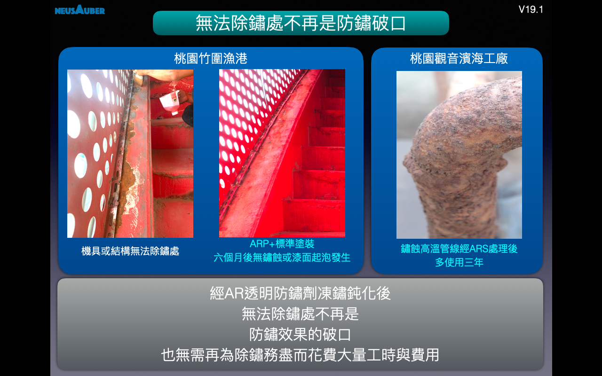
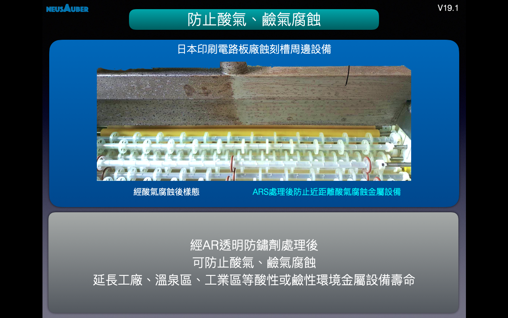
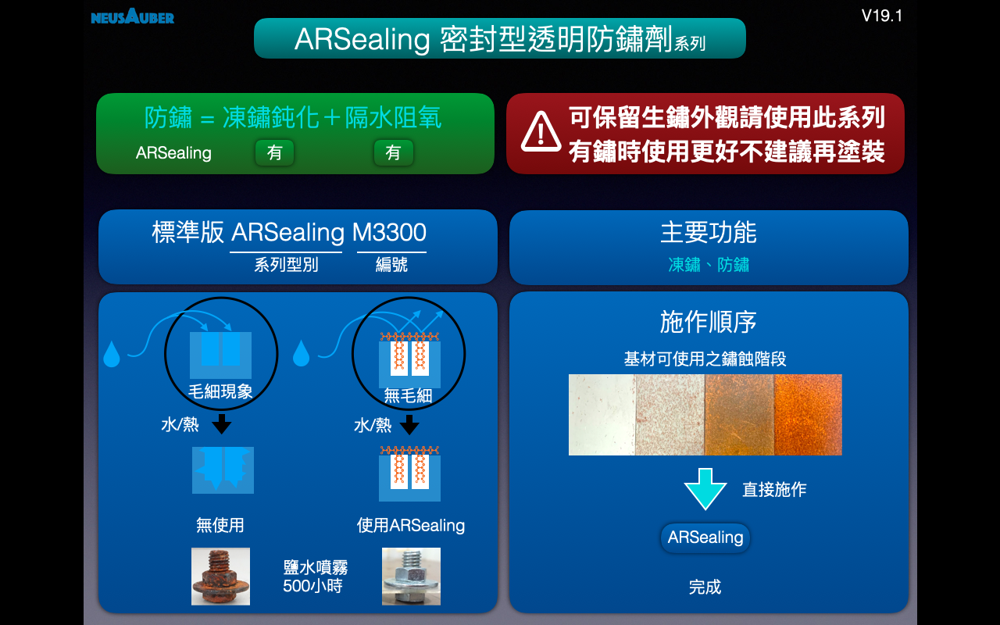
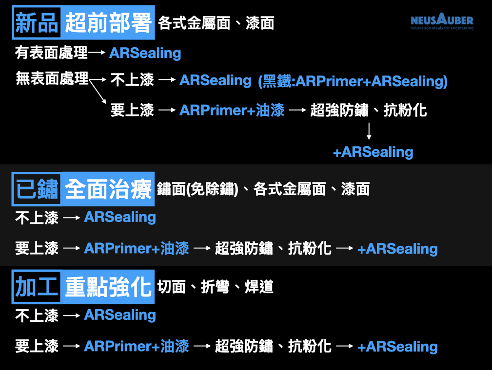
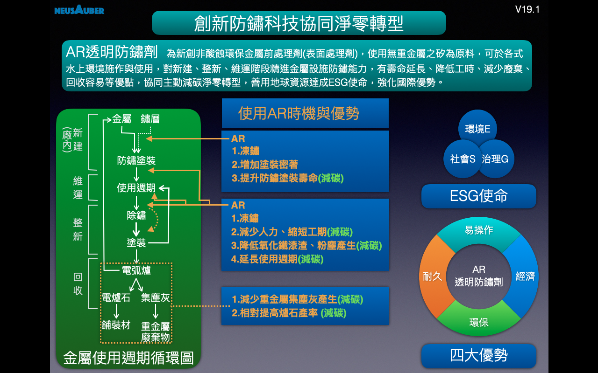

.. _h15331386d6d2f686745170745644:

AR透明防鏽劑 - 凍結鏽蝕
#######################

.. toctree:: 
    :maxdepth: 2
    :hidden:

    Home
    Products
    Demo
    Veri-test
    Contact
    About

.. _h761c451d126f4e1d335c376911446c4:

最新消息 
=========

.. _h504352586c195f796419761380302241:

2023年8月 AR透明防鏽劑防鏽效果比較
==================================

經工研院測試驗證之AR透明防鏽劑可在表面已鏽蝕的狀態下不除鏽直接塗佈，防鏽效果對比現行、市面銷售需要先除鏽之防鏽產品同級或更佳。

防鏽工程最困難與最耗時的瓶頸就在“除鏽工序”，特別是易鏽蝕的區域皆在行架或設備兩端，佈滿螺絲、焊道、支架端點等，更常見空間狹小導致難以施工，根本無法做到徹底除鏽，即使辛苦除完鏽蝕又無法在最短時間內上漆保護，在戶外又可能受到海風、硫氣、濕氣等影響加速表面產生微鏽，進而造成防鏽效果不佳。

只要使用AR透明防鏽劑，以上問題完全不會再是防鏽工程瓶頸，不用除鏽就可達到極佳工程品質，省卻除鏽工序所需的時間、成本、污染等，更大幅提升防鏽成功率與工程效率，更可延長維運頻度，減少後續不斷投入卻無法有效防鏽的隱藏成本。

.. _h1eb57112fa41a7929353a252c7b42:

2023年5月 新北市三貂嶺生態友善隧道獲法國建築師境外設計大獎
==========================================================

三貂嶺生態友善隧道是全國首座採鋼筋作為自行車道兼供步道使用的歷史建築，利用過去煤礦運輸產業沒落的廢棄隧道，透過創新方法將工業遺址轉變為多功能公共空間，施工過程小心地保存，展現自然生態及歲月痕跡，是座兼具生態及人文歷史的隧道。

三貂嶺生態友善隧道去年完工，設計團隊為達觀規劃設計顧問有限公司景觀設計師吳忠勳、法國MICHELE & MIQUEL建築與景觀設計事務所及設計師藍傑鴻等，將工程取名「THE DARK LINE」，報名參加法國建築師境外設計大獎（Grand Prix AFEX 2023 Awards）一舉獲獎，是法國海外建築師學會辦賽以來，第一個景觀設計作品，突破傳統的創新作法贏得眾人的讚賞與矚目，設計理念與永續發展特質從眾多參賽作品中脫穎而出，團隊很榮幸能代表台灣參賽，贏得這項殊榮。

法國建築師境外設計大獎於2010年起舉辦，配合威尼斯建築雙年展，2年一期，不分總類僅有一個得獎者。–節錄自LTN新聞網站報導

.. _h166f2532455c14791754618594c29:

2022年9月 新北市三貂嶺生態友善隧道入圍新北市工程金質獎評選
==========================================================

三貂嶺生態友善隧道使用AR透明防鏽劑為隧道全線鋼筋鋪面防鏽，法國設計師特以鏽化外觀融入當地長期潮濕自然生態，AR透明防鏽劑凍結鏽蝕，使鋼筋維持現況並長期維持結構強度，達到長久安全使用、維運容易的目標，此案得到入圍2022年政府工程金質獎評選肯定。

.. _h4972603049344646b43614b4912256a:

2022年4月 AR透明防鏽劑促進形成“耐蝕鈍化膜”達到令鐵金屬自我防鏽
==============================================================

長期追蹤鐵金屬及鏽層經AR透明防鏽劑處理後的表面，並由工研院負責檢測成分與腐蝕速度，實證AR透明防鏽劑可促進鐵金屬表面生成稱為”耐蝕鈍化膜”的氧化鐵(𝛃-FeOOH、Fe\ |STYLE0|\ O\ |STYLE1|\ 、Fe\ |STYLE2|\ O\ |STYLE3|\ )，此耐蝕鈍化膜具網狀結晶結構能緻密包覆底部金屬避免繼續快速生鏽。以塗上一底一面漆的鋼筋每年腐蝕速度2.12mm與具有此耐蝕鈍化膜的鋼筋0.04mm相比，每年腐蝕速度僅為其1/53，達成優秀的鐵金屬自我防鏽。

即使位於海邊表面的殘留氯離子，防鏽施作前不用清洗，也能被耐蝕鈍化膜吸納固定，不再擔心其影響腐蝕速度。

電子工廠酸蝕刻製程周邊金屬零配件，能透過使用AR透明防鏽劑長期保護，形成防酸氣侵蝕的優秀防腐蝕效果。

塗裝老化失效後使用過AR透明防鏽劑的區域也能促進形成耐蝕鈍化膜，在下次維護來臨前避免鐵金屬快速生鏽惡化影響結構安全。

.. _h691b354056506d1415553645c657a58:

2021年3月5日出刊 台灣省土木技師公會技師報1264期文章
===================================================

『\ |LINK1|\ 』

海上或濱海嚴苛C5以上環境使用AR透明防鏽劑之ARPrimer，即使表面塗裝因故失效後仍可保護金屬層不會快速鏽蝕與擴散，不但強化防鏽效果更延長保護時間，減少損壞與後續維護產生之高額損失。

.. _h92a51766d352b72667e543a1c125a71:

2020年10月11日11點撥出年代電視『點亮新台灣』節目專訪
====================================================

|REPLACE1|

.. _h2c1d74277104e41780968148427e:

經常性缺工及世界性通成本快速增長趨勢中

期待防鏽工法

能否讓鏽蝕停止惡化？

防鏽工序能否簡單或快一點？

維護頻率能否少一點？

總體成本能否降低？

防鏽效果能否持續久一點？

答案是可以的！    只要使用

.. _h6b417c78253075e44347e587a5f7f:

AR透明防鏽劑
============

處理您的金屬設施或設備，無論鏽蝕多嚴重，除鏽乾不乾淨都不再重要，甚至不除鏽效果更好、更快速、更省錢！

無論位在海上、海邊、溫泉區、工業區、高山多雨等鏽蝕嚴重區域，可防鹽分、防硫氣、防酸氣、防水氣的影響，快速達到專業耐久的防鏽效果！

AR透明防鏽劑透過獨家凍鏽鈍化機制終止鏽蝕活性避免惡化，並促進表面形成具保護底材金屬且細緻又穩定牢固的”耐蝕鈍化膜“，成份為自身氧化物的網狀結晶態氧化鐵，即便位處海邊，原始表面或鏽蝕裡含氯離子，使用AR透明防鏽劑後也能被吸納成耐蝕鈍化膜層的一部分。

經工研院測試研究”耐蝕鈍化膜“防鏽能力為一底一度(底塗＋面塗)的50倍以上。

系列產品成分符合歐盟 RoHS不含重金屬，溶劑符合美國無VOCs標準，透明薄膜符合美國FDA可接觸食品塗層，具備環境友善、施作安全、使用安心。

防鏽效果通過台灣CNS 4160防鏽能力標準、美國材料試驗協會ASTM B117防蝕標準、挪威鑽油平台Norsok M501防蝕標準。產品內容物符合台灣CNS4908標準。

AR透明防鏽劑為溶劑型化學藥液，液體無黏度滲透性強，不需要建立厚度或要求遮蓋率，只需讓藥液濕潤表面，光滑無鏽表面用量低，如使用水彩筆宣染之技巧即可，越粗糙或鏽面用量則酌予增加。

適用於海上、海邊、工業區、溫泉區等符合ISO12944之C5級以上重腐蝕地區設施。

橋樑、建築、動力車輛/底盤、機械設備、太陽能、風力發電、化學管線/槽/架、室內物品、食品設備、自行車等防鏽，所有室內、室外、高鹽害、高磺害之金屬設施或設備都適用，無法除鏽、除鏽困難區域更合適。鐵材、鋼材、鋼纜、銅製、鋁製、鎳鍍層、鋅鍍層、油漆層皆可用。

.. admonition:: 獨家“凍鏽鈍化”功能在室外也能防鏽前處理

    \ |IMG1|\ \ |IMG2|\ 

.. _h106d6a60386b4471802c17574203f54:

凍鏽消除游離鐵離子試驗
======================

|REPLACE2|

.. _h2c1d74277104e41780968148427e:

.. admonition:: 經凍鏽鈍化後之防鏽成效

    \ |IMG3|\ 

防鏽有八大難題，1.嚴重鏽蝕、2.浸泡海水、3.雨季施工、4.除鏽困難、5.不除鏽、6.耐酸氣、耐鹼氣、7.海邊不鏽鋼與非鐵金屬防鏽、8.焊道、斷面、邊緣防鏽，皆可透過使用AR透明防鏽劑獲得明顯改善或解決。

.. admonition:: 解決防鏽難題之一、二

    \ |IMG4|\ \ |IMG5|\ 

.. admonition:: 解決防鏽難題之三、四

    \ |IMG6|\ \ |IMG7|\ 

.. admonition:: 解決防鏽難題之五、六

    \ |IMG8|\ \ |IMG9|\ 

.. admonition:: 解決防鏽難題之七、八

    \ |IMG10|\ \ |IMG11|\ 

.. admonition:: 前處理使用AR透明防鏽劑凍鏽鈍化之效益

    \ |IMG12|\ \ |IMG13|\ 

.. admonition:: AR透明防鏽劑凍鏽鈍化實績

    \ |IMG14|\ \ |IMG15|\ 

.. _h2c1d74277104e41780968148427e:

.. _h174fb648377959437b5c1f697c1c40:

系列產品
========

.. admonition:: 以功能選用AR透明防鏽劑適用型號

    \ |IMG16|\ 

.. _h174fb648377959437b5c1f697c1c40:

產品介紹
========

ARPrimer底塗型透明防鏽劑

具有凍鏽、密著底漆功能之透明防鏽劑，可取代傳統所有底漆，如紅丹、合金底漆、鋅粉底漆、鏽轉化劑等，及提高面漆附著的功能。使用ARPrimer後不必等待固化，可直接施作所有種類面漆，達到凍鏽與防鏽功能。

.. admonition:: ARPrimer

    \ |IMG17|\ 

ARSealing密封型透明防鏽劑

同時具有凍鏽又防鏽雙效功能，只要施作一道，不必搭配ARPrimer底塗使用，即可保留鏽蝕外觀又兼具防鏽效果。

.. admonition:: ARSealing

    \ |IMG18|\ 
    

.. _h572187820253c7294643631303029:

選用及使用
==========

.. admonition:: 選用及使用

    \ |IMG19|\ 

.. _h2164242e4c6048506f23311549231654:

防鏽工法選用
============

.. admonition:: 防鏽工法示意

    \ |IMG20|\ 

＊實際年限以各地區環境為準。

.. _h507524361a55b2f195d763e73767f36:

協助淨零轉型目標
================

面對全球ESG宣告與淨零轉型需求，使用AR透明防鏽劑能協同使用者，於新建、維運、整新、及回收階段，都能減少人力使用、縮短工期、降低廢料產生與處理、延長產品生命週期，主動減碳淨零轉型並善用地球資源，達成ESG使命。

..  Note:: 

    \ |IMG21|\ 

.. admonition:: 諮詢聯絡資訊

    AR透明防鏽劑
    
    使用諮詢、購買，工作日週一～週五 09:00~17:30
    (僅對事業單位銷售，不對個人使用銷售)
    
    請聯絡
    
    意杰國際 03-3659119 葉先生
    
    \ |LINK2|\ 
    
    Line ID:@345rxpyp
    
    \ |IMG22|\ 
    
    (Line ID QR code)
    ✽無個人使用銷售，請勿加官方帳號，謝謝！！
    
    注意事項：
    
    請使用上列電子郵件或加入Line官方帳號詢價訂購，“無店頭或門市銷售”；訂購價格『已含運費』並以郵局或大榮貨運遞送；一般狀況下依訂購數量約3~7工作日內可收到貨，且僅開立三聯式發票。
    ＊艾杰旭集團、欣興電子集團、中鋼集團相關案件與施作廠商請直接來電03-3659119。

.. admonition:: 詢價與使用建議、訂購流程：（請直接複製使用）

    1.詢價與使用建議
    
    請於電子郵件或Line官方帳號提供下列資訊
    
    公司名： 
    
    聯絡人： 
    
    聯絡電話： 
    
    預計使用物件、狀態、面積： 
    
    該物件地理環境或地點： 
    
    最終希望塗裝或不需要塗裝： 
    
    2.訂購
    
    請於電子郵件或Line官方帳號提供下列資訊
    
    公司名： 
    
    統編： 
    
    收件人： 
    
    收件地址： 
    
    聯絡電話： 
    
    訂購型號： 
    
    包裝及數量： 
    

.. _h3f4a493a3855394f1d34466011394ee:

AR透明防鏽劑“DM下載”
====================

\ |LINK3|\ 

.. _h204e3e5f6946a384e565b96212613:

AR透明防鏽劑“最新簡報下載”
==========================

\ |LINK4|\  (2024.09.26)

(權利聲明：Neusauber、AR透明防鏽劑 為意杰國際註冊商標)

|REPLACE3|

|REPLACE4|

.. bottom of content

.. |STYLE0| replace:: :sub:`2`

.. |STYLE1| replace:: :sub:`3`

.. |STYLE2| replace:: :sub:`3`

.. |STYLE3| replace:: :sub:`4`

.. |REPLACE1| raw:: html

    <iframe width="100%" height="480" src="https://www.youtube.com/embed/sjp9d_hZdBQ
    " frameborder="0" allow="autoplay; encrypted-media" allowfullscreen></iframe>
.. |REPLACE2| raw:: html

    <iframe width="100%" height="480" src="https://www.youtube.com/embed/ykxmIw5lKmQ
    " frameborder="0" allow="autoplay; encrypted-media" allowfullscreen></iframe>
.. |REPLACE3| raw:: html

    
.. |REPLACE4| raw:: html

    

.. |LINK1| raw:: html

    <a href="http://etimes.twce.org.tw/%E6%96%BD%E5%B7%A5%E6%8A%80%E8%A1%93/3197-%E4%BB%A5%E8%A1%A8%E9%9D%A2%E8%99%95%E7%90%86%E6%94%B9%E5%96%84%E7%86%B1%E6%B5%B8%E9%8D%8D%E9%8B%85%E5%A1%97%E8%A3%9D%E9%98%B2%E9%8F%BD%E8%83%BD%E5%8A%9B%E4%B9%8B%E6%8E%A2%E8%A8%8E.html" target="_blank">以表面處理改善熱浸鍍鋅塗裝防鏽能力之探討</a>

.. |LINK2| raw:: html

    <a href="mailto:service@neusauber.com">service@neusauber.com</a>

.. |LINK3| raw:: html

    <a href="https://drive.google.com/file/d/1RfcV_udNhXi_vlOJz6sMG8yAWCJElH63/view?usp=sharing" target="_blank">DM(PDF)</a>

.. |LINK4| raw:: html

    <a href="https://drive.google.com/file/d/1p98M0m3xQYC1ntQpD_vFJk8j5hjCfHiL/view?usp=sharing" target="_blank">簡報檔V20.1(PDF)</a>

.. |IMG1| image:: static/index_1.png
   :height: 426 px
   :width: 682 px

.. |IMG2| image:: static/index_2.png
   :height: 426 px
   :width: 682 px

.. |IMG3| image:: static/index_3.png
   :height: 426 px
   :width: 682 px

.. |IMG4| image:: static/index_4.png
   :height: 426 px
   :width: 682 px

.. |IMG5| image:: static/index_5.png
   :height: 426 px
   :width: 682 px

.. |IMG6| image:: static/index_6.png
   :height: 426 px
   :width: 682 px

.. |IMG8| image:: static/index_8.png
   :height: 426 px
   :width: 682 px

.. |IMG10| image:: static/index_10.png
   :height: 426 px
   :width: 682 px

.. |IMG11| image:: static/index_11.png
   :height: 426 px
   :width: 682 px

.. |IMG12| image:: static/index_12.png
   :height: 426 px
   :width: 682 px

.. |IMG13| image:: static/index_13.png
   :height: 426 px
   :width: 682 px

.. |IMG14| image:: static/index_14.png
   :height: 426 px
   :width: 682 px

.. |IMG15| image:: static/index_15.png
   :height: 426 px
   :width: 682 px

.. |IMG16| image:: static/index_16.png
   :height: 426 px
   :width: 682 px

.. |IMG17| image:: static/index_17.png
   :height: 426 px
   :width: 682 px

.. |IMG19| image:: static/index_19.png
   :height: 426 px
   :width: 682 px

