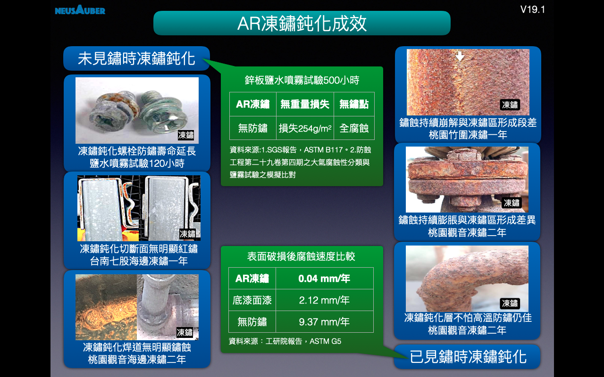

.. _ha552d4339442b4514686d7839564:

\ |LINK1|\ 
###########

.. toctree:: 
    :maxdepth: 2
    :hidden:

    Home
    Products
    Demo
    Veri-test
    Contact
    About

\ |STYLE0|\ 

\ |STYLE1|\ 

.. admonition:: 

    \ |STYLE2|\ 
    
    \ |STYLE3|\ 
    
    \ |STYLE4|\ 

.. _h2c1d74277104e41780968148427e:

.. _h4d6f3477351cc1b2f2b27444e246a59:

AR透明防鏽劑有幾種？
====================

AR透明防鏽劑有兩種

第一種，ARPrimer底塗型透明防鏽劑，取代傳統所有底漆，如紅丹、合金底漆、鋅粉底漆、鏽轉化劑等，具有凍鏽、提高面漆附著的功能。使用ARPrimer後不必等待固化，可直接施作所有種類面漆，達到凍鏽與防鏽功能。

第二種，ARSealing密封型透明防鏽劑，同時具有凍鏽及防鏽功能，只要施作一道，不必搭配ARPrimer底塗使用，即可保留鏽蝕外觀又兼具防鏽效果。

.. admonition:: 

    \ |IMG1|\ 

.. _h352f7c223e227a1f7bc363b175a536a:

AR透明防鏽劑防鏽可以多久？
==========================

根據I\ |LINK2|\ 測試於海邊環境，使用ARSealing在已鏽蝕金屬，下一次修補時間可達2-5年。使用ARPrimer+Epoxy面漆在已鏽蝕金屬，下一次修補時間可達5-15年。

＊實際年限以各地區環境為準。

.. admonition:: 

    \ |IMG2|\ 

.. _h6862165f141347241b4d8375231664b:

採用AR透明防鏽劑實例
====================

.. _h475c3f1a256741e29206e1471131f2a:

🥇台灣高速公路遠通電收ETC電子收費設備門架防鏽改善工程
-----------------------------------------------------

免除鏽之ARPrimer底塗凍鏽＋面漆保護工法，通過主管機關長期嚴格檢驗，效果遠優於先除鏽再使用鋅粉底漆的傳統方式，決定全線施作使用。

相較傳統工法，使用ARPrimer工法，在工時、人力、搭配設備上僅需原有的1/4，且無須交圍影響交通，除費用大幅減少、工期縮短、降低工安風險等，更延長維護週期，達到成本、施作效率及高品質三贏。

\ |IMG3|\ 

.. _hf3a346f3b7015671213b2854191d7b:

🥇電廠發電機隔相匯流排導管(IPBD)防鏽
------------------------------------

高等級安全要求、長時不停機、海蝕環境，使得負載 550 MVA、表面溫度約200℃之大電流的電力傳輸設備，隔相匯流排導管(IPBD)深陷鏽蝕危機之中。工研院團隊評估除鏽後使用ARSealing來凍鏽與防鏽。ARSealing不影響表面導電性、凍結鏽蝕、停止鍍層鏽蝕剝落並全面防鏽，安全度過18個月歲修週期惡劣環境的挑戰，持續穩定輸出電力中。

\ |IMG4|\ 

.. _h5e6d61421a7146385259747a2661225:

\ |LINK3|\ 
===========

|REPLACE1|

.. bottom of content

.. |STYLE0| replace:: **淡黃色無黏度透明溶液，非油漆或鏽轉化劑系統。以獨家合成之強反應多官能基小分子化合物(PFRP, Polyfunctional Reactive Polymer)，滲入鏽蝕最底部搶先還原具反應性的被氧化金屬離子，凍結鏽蝕反應進行，該處將不再返鏽。**

.. |STYLE1| replace:: **經凍鏽後原鏽層即為附著極佳與覆蓋完整之最理想無機保護層，防護金屬再度氧化。施作簡單、快速，防鏽效果佳、壽命長。**

.. |STYLE2| replace:: **三大特點：免除鏽、施作快、不返鏽**

.. |STYLE3| replace:: **五種適用面：金屬面、鏽蝕面、油漆面、高熱面、低溫面**

.. |STYLE4| replace:: **七項優勢：用量省、免技巧、不挑漆、無膜厚、全透明、超環保、效果長**

.. |REPLACE1| raw:: html

    

.. |LINK1| raw:: html

    <a href="https://drive.google.com/open?id=1nHSIBiyQrueS9QiOmFhxDkDCfI8NeGzX" target="_blank">AR透明防鏽劑</a>

.. |LINK2| raw:: html

    <a href="http://tw.neusauber.com/zh_TW/latest/_images/Demo_2.png" target="_blank">SO12944標準</a>

.. |LINK3| raw:: html

    <a href="https://drive.google.com/open?id=1nHSIBiyQrueS9QiOmFhxDkDCfI8NeGzX" target="_blank">AR透明防鏽劑簡報下載</a>

.. |IMG1| image:: static/index_1.png
   :height: 742 px
   :width: 682 px

.. |IMG2| image:: static/index_2.png
   :height: 490 px
   :width: 682 px

.. |IMG4| image:: static/index_4.png
   :height: 296 px
   :width: 697 px
