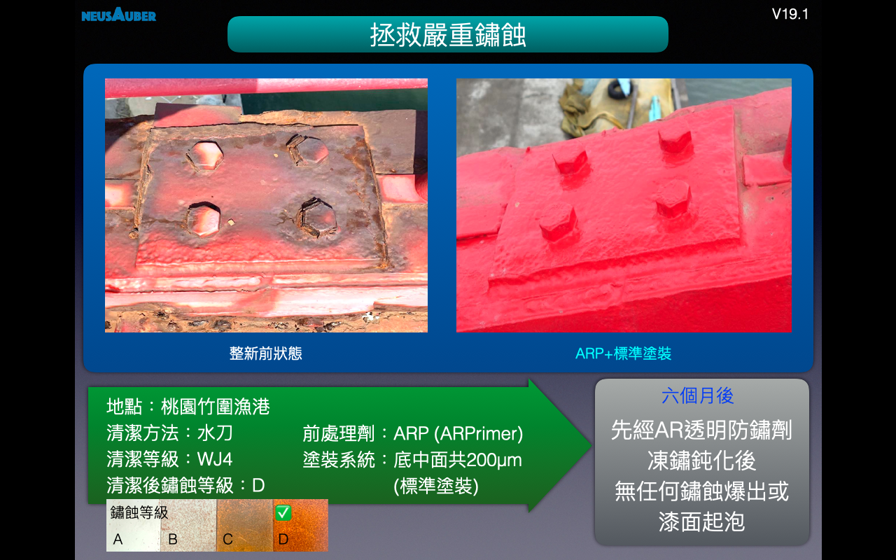

.. _h461161d721637113f68205a12497637:

Neusauber AR透明防鏽劑
######################

.. toctree:: 
    :maxdepth: 2
    :hidden:

    About
    Products
    Demo
    Veri-test
    Contact

|REPLACE1|

.. _h475c3f1a256741e29206e1471131f2a:

🥇台灣高速公路遠通電收ETC電子收費設備門架防鏽改善工程
-----------------------------------------------------

免除鏽之ARPrimer底塗凍鏽＋面漆保護工法，通過中興工程、高公局長期嚴格檢驗，效果遠優於先除鏽再使用鋅粉底漆的傳統方式，決定全線施作使用。

相較傳統工法，使用ARPrimer工法，在工時、人力、搭配設備上僅需原有的1/4，除大幅減少費用、縮短工期減少氣候等不確定因素外，更延長再次維護的週期與降低工安風險，達到施作效率與高品質。

\ |IMG1|\ 

.. _hf3a346f3b7015671213b2854191d7b:

🥇電廠發電機隔相匯流排導管(IPBD)防鏽
------------------------------------

高等級安全要求、長時不停機、海蝕環境，使得重要的隔相匯流排導管(IPBD)，負載 550 MVA、表面溫度約200℃之大電流的電力傳輸設備深陷鏽蝕危機之中。除鏽後工研院評估選用ARSealing，不影響表面導電性、停止原鍍層剝落、凍結鏽蝕及防鏽，安全度過18個月歲修週期惡劣環境的挑戰，持續穩定輸出電力中。

\ |IMG2|\ 

.. _h79c6077c41304c4a7849a4f396c53:

”金屬從它被製造出來的當下就開始鏽蝕“ ... Matthew R. Simmons,國際知名能源基金創辦人 
-----------------------------------------------------------------------------------

\ |STYLE0|\ 

除了先要求把鏽除乾淨並塗上犧牲型止鏽漆之外，更要求使用非常厚實的塗料包裹金屬，避免外來因素造成金屬鏽蝕。

但實務上的除鏽工法卻是造成金屬裸露及快速鏽蝕的主因之一，例如水刀除鏽或噴砂除鏽。況且還有許多無法使用任何除鏽工法的情況。

水刀除鏽：除因背面、狹窄、或小角度無法處理外，除鏽後裸露金屬直接暴露在未乾的水中，造成新生鏽蝕。

噴砂除鏽：效果好且令表面銳利粗化，雖可提高油漆附著，但遍佈表面的尖銳處卻極易吸濕，若沒有在30分到一小時內上漆保護，表面即會大量生成黑色鏽點，但實務上幾乎難以達成時限內上漆保護因而產生鏽蝕。

研磨除鏽：表面產生的高熱會透過空氣中濕氣進行熱交換降溫，溫熱裸露金屬表面接觸到水氣後，隨即快速產生鏽蝕。

為解決除鏽後產生的鏽蝕，現行做法常使用鋅粉底漆作為消除鏽蝕的功能。然生鏽後鏽蝕活性乃在金屬表面活動，而鋅粉底漆與金屬表面間卻有鏽蝕層阻擋，鋅粉無法直接接觸鏽蝕活性並予以消除，因此只鏽效果有限（如下圖）。

\ |IMG3|\ 

一但鏽蝕被包入油漆層內，更不因水氣、空氣被隔絕鏽蝕活動因此而中止。鏽本身成分就含結晶水，雖少了氧氣來源，但結晶水會因鏽蝕活性電子而被迫解離成氫氧基(OH-)與酸性氫離子(H+）支持鏽蝕繼續進行，並產出二氧化二鐵與氫氣，最終體積膨脹後撐破上層油漆造成更嚴重的鏽蝕（如下圖）。

\ |IMG4|\ 

而厚實的塗料更大大延後這些鏽蝕被發現的時間點，每個鐵離子變成氧化鐵體積會膨脹40~50%，等到鏽蝕總體積大到足以突破這厚實塗層時，相對的它已經往金屬的內部侵蝕的更深，反而令欲保護的金屬損失更多，大幅減少使用壽命。

.. _h2c1d74277104e41780968148427e:

.. _h4a49535b5f49685536b4c5c65426f6c:

AR透明防鏽劑系列
================

.. _h277f71645975303b4935231381454:

意杰國際Neusauber團隊開發“凍鏽“關鍵技術，藉由化學降低不飽合鍵技術以消除反應活性，可滲入鏽蝕底層主動對鏽蝕活性進行凍結令鏽蝕反應停止，免除鏽就可達成防鏽目的。
=============================================================================================================================================================

.. _h744c5c48494d5642fbe5627284220:

採用Neusauber獨家凍鏽技術，除可凍鏽外，更具有提高油漆附著，縮短作業時間藉以改善或補足現行防鏽理論的盲點與實務執行的難度，達到防鏽應有的設計壽命。
=================================================================================================================================================

.. _h346270652d502e4d3e5a314f6db3261:

可取代紅丹、鋅粉底漆或油漆等使用，產品經SGS檢驗皆符合國際綠色環保產品RoHS標準，施作時無對人體有害揮發性鹵化物溶劑VOCs，膜層更符合美國FDA重複使用食品容器塗層標準。
==================================================================================================================================================================

➤\ |STYLE1|\ 

 功能：凍鏽、提高漆料附著、取代底漆

 特點：

 1.凍鏽後鏽層不再侵蝕金屬，不會膨脹起泡

 2.事前免除鏽、免等固化，塗完直接上面漆

 3.增加塗料防返鏽壽命3倍

 4.取代合金底漆、紅丹底漆、鋅粉底漆

 5.提高鍍鋅、不鏽鋼或其他平滑表面漆料附著能力

 6.需搭配面漆使用，面漆越好防鏽效果越強

➤\ |STYLE2|\ （原型號：AR）

 功能：凍鏽、防鏽

 特點：

 1.凍鏽後鏽層不再侵蝕金屬，不會膨脹起泡

 2.免除鏽，塗完就收工，30分鐘後防護生效

 3.透明膜層不改變外觀，各種表面皆可施作

 4.防止水氣、鹽分、硫氣、酸氣侵蝕

 5.提高面漆或原有表面處理防鏽能力3倍

 6.新品、已鏽蝕表面皆可使用

 7.可單獨或於面漆後施作

\ |IMG5|\ 

|REPLACE2|

.. bottom of content

.. |STYLE0| replace:: **現行防鏽理論**

.. |STYLE1| replace:: **型號：ARPrimer M3100 底塗型透明防鏽劑 專業級1號**

.. |STYLE2| replace:: **型號：ARSealing M3300 密封型透明防鏽劑 專業級3號**

.. |REPLACE1| raw:: html

    <iframe width="100%" height="480" src="https://www.youtube.com/embed/OGxucssXjuM" frameborder="0" allow="autoplay; encrypted-media" allowfullscreen></iframe>
.. |REPLACE2| raw:: html

    
.. |IMG1| image:: static/index_1.png
   :height: 486 px
   :width: 650 px

.. |IMG2| image:: static/index_2.png
   :height: 296 px
   :width: 697 px

.. |IMG3| image:: static/index_3.png
   :height: 393 px
   :width: 421 px

.. |IMG5| image:: static/index_5.png
   :height: 397 px
   :width: 426 px
